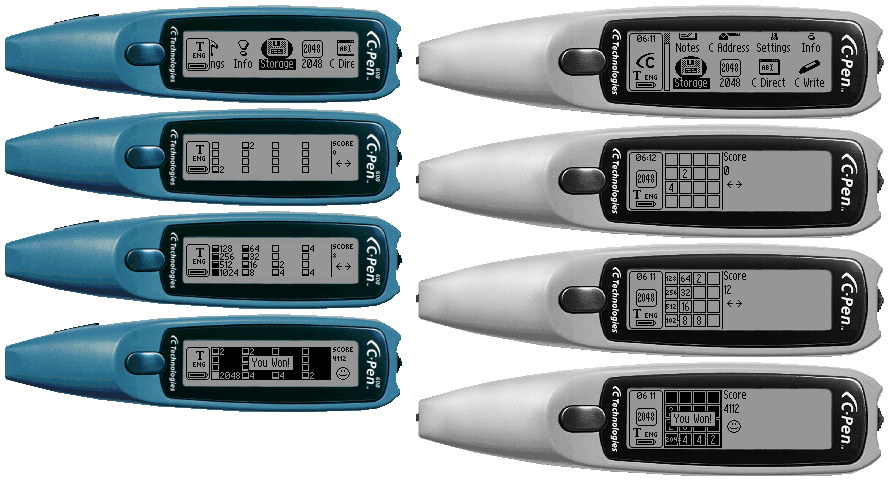

2048-ARIPOS
===========

C-Pen is the original high-quality state-of-the-art pen scanner. C-Pen scanners work on the ARIPOS platform. Founded in 1998 in Lund, Sweden.



| Device         | Flash memory size         | LCD resolution  | Note                                          |
|----------------|---------------------------|-----------------|-----------------------------------------------|
| C-Pen Original | Total: 8MB   User: ~5MB   | 202x32 pixels   | The first C-Pen model.                        |
| C-Pen 200      | Total: 2MB   User: ~200KB | 150x16 pixels   | Second generation casing design.              |
| C-Pen 600      | Total: 6MB   User: ~4MB   | 168x33 pixels   | No real time clock included.                  |
| C-Pen 800      | Total: 8MB   User: ~5MB   | 200x56 pixels   | Automatic trigger at the tip of the pen.      |

## C-Pen SDK

Download [C-Pen SDK 1.11 & Unicode Support](https://archive.org/details/cpen-sdk-1-11-unicode) archive, and install SDK on Oracle VM VirtualBox or VMWare Workstation Player with Windows and Microsoft Visual C++ 6.0 IDE.

## Prepare

Copy **2048-ARIPOS** directory to the `C:\Program Files\C Technologies\C-Pen SDK\Aripos\projects` catalog.

```sh
cd 2048
tar hcvf 2048-ARIPOS.tar 2048-ARIPOS
```

The `2048-ARIPOS.tar` archive will contain all files instead of symlinks.

## Build for WinPen simulator

```bat
vcvars32

make WINPEN=1 uninstall
make WINPEN=1 clean
make WINPEN=1
```

You can run and debug the application in Microsoft Visual C++ by pressing **F5** button. Please set the run executable to the `C:\Program Files\C Technologies\C-Pen SDK\Aripos\winpen\bin\WinPen.exe` file.

## Build for C-Pen

```bat
make uninstall
make clean
make
```

Get `2048-ARIPOS-ASCII.car` file from the `archive` directory and install it on the device.

## Build for C-Pen (Unicode Support)

The SDK should be patched for Unicode support, see the `sdk_unicode.zip` archive.

```bat
make _UNICODE=1 uninstall
make _UNICODE=1 clean
make _UNICODE=1
```

Get `2048-ARIPOS-UNICODE.car` file from the `archive` directory and install it on the device.

## Hardware

  

* C-Tech ARGUS CT1000A0-BG 0040: A custom Intel StrongARM SA-110 @ 100 MHz CPU by C-Tech.
* Samsung K4G323222M: 4 MB SDRAM.
* Toshiba TC58V64AFT: 8 MB NAND EEPROM.

Thanks to **SHBEN** for the photos.

## C-Pen Development Environment

Microsoft Visual C++ 6.0 IDE and WinPen simulator:


## Versions

* Windows 2000
* Microsoft Visual C++ 6.0
* gcc 2.96

```
arm-elf-gcc -v
Reading specs from C:\PROGRA~1\CTECHN~1\C-PENS~1\ARIPOS\armelf\lib\gcc-lib\arm-elf\2.96\specs
gcc version 2.96 20000207 (experimental)
```

## Thanks

* SHBEN (@SHU8IT)
* Alexander (@sashapont)
