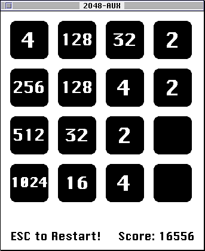
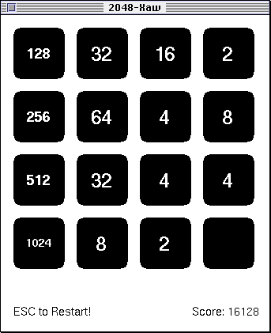

2048-AUX
========

| Black & White | "256" Colors | "Thousands" Colors | "Millions" Colors |
|---------------|--------------|--------------------|-------------------|
|  |  |  |  |

[https://github.com/EXL/2048/tree/master/2048-Carbon/2048-AUX](https://github.com/EXL/2048/tree/master/2048-Carbon/2048-AUX)

The "2048" game for the [Apple A/UX](https://en.wikipedia.org/wiki/A/UX) operating system (tested on A/UX 3.0 & System 7.0.1), the port is presented in three versions:

* 2048-AUX: Color version, runs in native A/UX Finder (32-bit) environment, with using [Macintosh Toolbox](https://en.wikipedia.org/wiki/Macintosh_Toolbox) and [QuickDraw](https://en.wikipedia.org/wiki/QuickDraw) technologies.
* 2048-Xaw: Black & White version, runs in both X11 and native A/UX Finder (32-bit) + [MacX](https://en.wikipedia.org/wiki/MacX) environments, with using [X Window System](https://en.wikipedia.org/wiki/X_Window_System), [Xlib](https://en.wikipedia.org/wiki/Xlib) and [Xaw](https://en.wikipedia.org/wiki/X_Athena_Widgets) libraries.
* 2048-Xaw: Black & White version, runs in both X11 and native A/UX Finder (32-bit) + [MacX](https://en.wikipedia.org/wiki/MacX) environments, with using [X Window System](https://en.wikipedia.org/wiki/X_Window_System) and [Xlib](https://en.wikipedia.org/wiki/Xlib) library.

## Setup Shoebill and Basilisk II Development Environment

1. Install [Shoebill](https://github.com/pruten/shoebill) [Macintosh II](https://en.wikipedia.org/wiki/Macintosh_II) emulator that runs Apple A/UX operating system.

    ```bash
    git clone https://github.com/kanjitalk755/shoebill
    cd shoebill/sdl-gui/
    ./lin_build.sh
    ```

2. Download a bootable ISO-image of Apple A/UX 3.0 system: ["AUX_3_Use_in_Shoebill.zip"](https://www.macintoshrepository.org/1696-a-ux-apple-unix-for-68k-version-3-0-1-3-1-update) and unpack it.

3. Download ["Macintosh II ROM"](https://www.google.com/search?&q=macintosh+ii+rom) file in Google.

4. See "ReadMe.md" file for [2048-MCW](../2048-MCW/) project and install and setup [Basilisk II](https://en.wikipedia.org/wiki/Basilisk_II) emulator through this manual, then install any version of [classic Mac OS](https://en.wikipedia.org/wiki/Classic_Mac_OS) (e.g. Mac OS 8.1) to Basilisk II, it is needed to transfer files to inside Apple A/UX system.

## Transfer source code to Apple A/UX bootable image

1. Create a [tarball](https://en.wikipedia.org/wiki/Tar_(computing)) archive with the source code of 2048-AUX project on the host machine:

    ```bash
    git clone https://github.com/EXL/2048
    tar -cvf 2048.tar 2048/2048-Carbon/2048-AUX/ 2048/src/
    ```

2. Run Basilisk II emulator and mount "Apple_UNIX.iso" image on "Volumes" tab then click "Start" button to run classic Mac OS.

3. Copy "2048.tar" archive from "Unix" disk to "A/UX CDInstall" disk.

4. Shutdown Basilisk II emulator.

## Setup Apple A/UX system

1. Run Apple A/UX 3.0 in Shoebill emulator and setup it:

    ```bash
    ./shoebill disk0=Apple_UNIX.iso rom=MacII.ROM width=800 height=600 ram=128
    ```

2. Login in as:

    Registered User
    Name: root
    Password: [empty]

3. Click "Apple" icon in main menu choose "Control Panels" then double click on "Monitors" icon and set "256 Colors".

4. Double click on "Memory" icon and set maximum "Cache Size".

5. Shutdown machine by "Special" => "Shut Down" menu and close emulator window.

## Building 2048-AUX, 2048-Xaw, and 2048-Xlib in Apple A/UX

1. Increase emulator memory to 256 MB RAM:

    ```bash
    ./shoebill disk0=Apple_UNIX.iso rom=MacII.ROM width=800 height=600 ram=256
    ```

    Changing memory size will help get rid of errors like "compiler error: Cannot allocate symbol table" and some "Error: 0" errors.

2. Copy "2048.tar" archive from "A/UX CDInstall" disk to root "/" disk.

3. Click "Apple" icon in main menu and run "CommandShell" application.

    ```sh
    fcnvt -f -d 2048.tar src.tar
    tar -xovf src.tar
    rm *.tar
    cd 2048/2048-Carbon/2048-AUX/
    make clean
    make release
    ```

    *Note.* The `fcnvt` utility is used to convert the AppleSingle file to AppleDouble format and split file attributes from data into a separate file "%src.tar".

## Run 2048-AUX, 2048-Xaw, and 2048-Xlib application in A/UX Finder (32-bit) environment

Eventually 2048-AUX application consists of two files, "2048-AUX" executable and "%2048-AUX" resource file. Both of these files must reside in the same directory when 2048-AUX is run. Go to the "/2048/2048-Carbon/2048-AUX/" directory and double click on "2048-AUX" executable file.

To run the ["2048-Xaw"](../../2048-Xaw/) and ["2048-Xlib"](../../2048-Xlib/) ports, you must first start MacX program. Click "Apple" icon in main menu choose "Control Panels" then double click on "Monitors" icon and set "Thousands Colors". Go to the "/mac/MacX" directory and run "MacX" program. Then go to the "/2048/2048-Carbon/2048-AUX/" directory and double click on "2048-Xaw" or "2048-Xlib" executable file. Then click "2048-Xaw" or "2048-Xlib" button, activate MacX program and permit connection of X11 client to run selected application.

## Run 2048-Xaw and 2048-Xlib application in X11 environment

Choose "Special" => "Logout" item from main menu then choose "Options" => "Change Session Type" => "X11", Name: root, Password: [empty], and click "This Session Only" then "Login" buttons.

```sh
cd /2048/2048-Carbon/2048-AUX/
./2048-Xaw
./2048-Xlib
```

Position the window in ["twm"](https://en.wikipedia.org/wiki/Twm) with the cursor and click.

## Additional Information

Useful information about the Shoebill emulator on the [Emaculation](https://emaculation.com/forum/viewtopic.php?t=8288) forum.

See [NotesClassicMacOS.md](../../doc/NotesClassicMacOS.md) document for some additional information.

## Apple A/UX Development Environment

The ["Vi v3.9 2/9/83"](https://en.wikipedia.org/wiki/Vi) text editor running in "CommandShell v3.0" terminal emulator in A/UX Finder (32-bit) environment:


The ["Vi v3.9 2/9/83"](https://en.wikipedia.org/wiki/Vi) text editor running in ["xterm"](https://en.wikipedia.org/wiki/Xterm) terminal emulator in X11 environment under ["twm"](https://en.wikipedia.org/wiki/Twm).


## Versions

* [Shoebill v0.0.4](https://github.com/pruten/shoebill) | [Shoebill v0.0.4 fork](https://github.com/kanjitalk755/shoebill)
* [Apple A/UX 3.0 & System Software 7.0.1](https://www.macintoshrepository.org/download.php?id=2803)

Compiler on Apple A/UX 3.0 system:

```
cc -V 2>&1 | head -2

ld : M68020 Release R2V1 sgs.h : Version 1.5: 3/13/83
```

Based on Motorola SGS (Software Generation System) suite.

## Additional Screenshots

| 2048-Xaw @ MacX @ A/UX Finder (32-bit) | 2048-Xaw @ X11 @ twm |
|----------------------------------------|----------------------|
|  |  |

| 2048-Xlib @ MacX @ A/UX Finder (32-bit) | 2048-Xlib @ X11 @ twm |
|-----------------------------------------|-----------------------|
|  |  |
