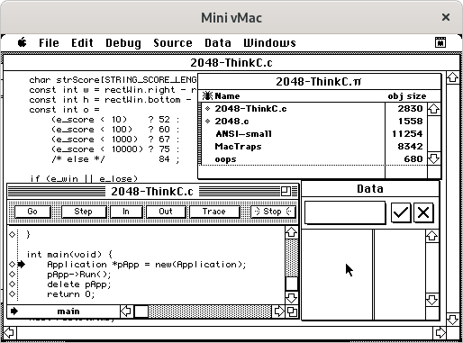

2048-IIGS
=========


[https://github.com/EXL/2048/tree/master/2048-Carbon/2048-IIGS](https://github.com/EXL/2048/tree/master/2048-Carbon/2048-IIGS)

The "2048" game for the [Apple IIGS](https://en.wikipedia.org/wiki/Apple_IIGS) and [GS/OS](https://en.wikipedia.org/wiki/Apple_GS/OS) operating system with using [Macintosh Toolbox](https://en.wikipedia.org/wiki/Macintosh_Toolbox) and [QuickDraw II](https://en.wikipedia.org/wiki/QuickDraw) technologies.

## Setup GSplus Development Environment

1. Download GSplus emulator from the [official website](https://apple2.gs/plus/) or [GitHub releases](https://github.com/digarok/gsplus/releases) and unpack it.

2. Download CiderPress program from the [official website](https://a2ciderpress.com/) or [GitHub releases](https://github.com/fadden/ciderpress/releases) and install it.

### Install GS/OS Operation System

1. Download [ROM version 3](https://macgui.com/downloads/?file_id=11145) | [Mirror](https://www.apple.asimov.net/emulators/rom_images/iigs_rom03.zip) for Apple IIGS, unpack it, rename to **ROM3** and move to the emulator directory.

2. Download GS/OS 6.0.1 installation disk images [1](https://macgui.com/downloads/?file_id=11690), [2](https://macgui.com/downloads/?file_id=11691), [3](https://macgui.com/downloads/?file_id=11692), [4](https://macgui.com/downloads/?file_id=11693), [5](https://macgui.com/downloads/?file_id=11694), [6](https://macgui.com/downloads/?file_id=11695), [7](https://macgui.com/downloads/?file_id=11696) and save them to the emulator catalog.

    *Note №1.* Some mirrors of installation disks in archives: [System.ver.6.0.1.English.rar](http://old-dos.ru/dl.php?id=10212) | [System_6.0.1.zip](https://www.apple.asimov.net/images/gs/os/gsos/System_6.0.1.zip)

    *Note №2.* Alternatively, a ready-to-use hard disk image with the installed GS/OS 6.0.1 System Software is available on the Internet Archive website: [System_Software_6.0.1_Harddisk_1989_Apple.2mg](https://archive.org/download/a2gs_System_Software_6.0.1_Harddisk_1989_Apple).

3. Run CiderPress program and make empty hard disk drive image by "File" => "New" => "Disk image..." with the following parameters:

    * Filesystem: ProDOS
    * New disk size: 32MB (largest ProDOS volume)
    * ProDOS options: ProDOS volume name (15 chars): HARD.DISK

    Save image file as **hard_disk_image.po** into emulator directory. CiderPress program can be used to exchange files between the host and the emulated system.

4. Run GSplus emulator, then push **F4** key, go to the "Disk Configuration", and set **s5d1** to the first GS/OS installation disk, **s5d2** to the second GS/OS installation disk, **s7d1** to the created empty hard disk image.

    *Note №3.* There is a bug in the emulator when the system doesn't detect the inserted disk image. Choosing the same disk twice helps in this situation.

    Choose "Back to Main Config", set "Speed" to the "8.0MHz (ZIP)", then choose "Save changes to configuration file", and "Exit Config (or press F4)".

5. Type `C500G` in the "\*" prompt, to load the GS/OS installer program and click big "Easy Update" button to install GS/OS 6.0.1 System Software to the empty hard disk image.

    *Note №4.* To change disk images use **F4** key and **s5d2** slot.

    After successful installation, click the "Customize" button and use the **Alt** key to select the following components to install:

    * Application: Archiver
    * Application: Teach
    * Control Panel: Sounds
    * Desk Acc: Calculator
    * Desk Acc: Find File
    * File System: DOS 3.3 FST
    * File System: HFS FST
    * Fonts: All

6. Hit **F4**, go to the "Disk Configuration" menu and eject **s5d1** and **s5d2** disk images by pushing **E** key, then save configuration file and exit configuration menu. Now reboot machine by presing "Ctrl + F1 + F12" keys combination and the GSplus will boot into the installed GS/OS 6.0.1 System Software.

7. Go to "Special" => "Preferences...", uncheck "Check 5.25″ drives on Finder start" mark, and click "Accept" button.

See additional information about installing GS/OS operating system for Kegs32 emulator (GSplus is modern fork of Kegs32) on [E-Maculation](https://www.emaculation.com/doku.php/kegs) wiki.

### Apple IIGS Programmer's Workshop (APW) and Apple IIGS Programmer's Workshop C (APW C) Installation Procedure

1. Download [APW v1.0](https://archive.org/download/e2gs_0173_APW_v1.0/0173_APW_v1.0.po) and [APW C compiler](https://archive.org/download/e2gs_0127_APW_C-compiler/0127_APW_C-compiler.po) disk images from Internet Archive website.

2. Mount **APW_v1.0.po** to the **s5d1** and **APW_C-compiler.po** to the **s5d2** slots.

3. Go to the "APW:APW" directory on the first image disk, run "APW.SYS16" application and type following commands:

    ```
    cat
    prefix /APW/
    installhd /APW/ /HARD.DISK/
    prefix /APWC/
    copy -c /APWC/LANGUAGES/= /HARD.DISK/LANGUAGES/
    copy -c /APWC/LIBRARIES/= /HARD.DISK/LIBRARIES/
    ```

    After executing commands from this recipe APW Shell and APW C compiler will be installed to the system.

### ORCA and ORCA/C Installation Procedure

// TODO. Optional.

## Build 2048-IIGS using APW Shell

```
prefix /HARD.DISK/
create PROJ
prefix PROJ/

cc

host: unix2mac App.2048.cc
host: unix2mac Src.2048.c
host: unix2mac Src.2048.h

filetype App.2048.cc SRC
filetype Src.2048.c SRC
filetype Src.2048.h SRC
filetype Icons/IIGS.2048.Icons $CA

change App.2048.cc CC
change Src.2048.c CC
change Src.2048.h CC

compile App.2048.cc keep=App.2048 cc=(-DAPW=1)
line 2/start App.2048 keep=App.2048

cmpl App.2048.cc keep=App.2048 cc=(-DAPW=1)

compact App.2048
filetype App.2048 S16
rename App.2048 IIGS.2048.S16
```


## Build

1. Drag-and-drop "[2048-MAC.dsk](../DiskImages/)" floppy disk image to the Mini vMac emulator window, then copy "2048-ThinkC" folder on the storage drive.
2. Open "2048-ThinkC:2048-ThinkC.π" project file with Symantec THINK C IDE.
3. In the main menu choose "Project" => "Build Application...", then click "Yes" button.
4. Save application as 2048-ThinkC with "Smart Link" option, replace existing file.
5. Get resulted executable file for [Motorola 68000](https://en.wikipedia.org/wiki/Motorola_68000) architecture in the "2048-ThinkC" directory.

### Installing the application icon manually with ResEdit

*Note.* These actions aren't required if you are using "2048-ThinkC.π" project file in the Symantec THINK C IDE. The ResEdit program by Apple located in the "Mac OS 6:Development:THINK C 5.0 Utilities:ResEdit 2.1.1" directory where "Mac OS 6" is the storage drive.

1. Open "2048-ThinkC:2048-ThinkC.π.rsrc" resource file with Apple ResEdit program.
2. In the main menu choose "File" => "Get File/Folder Info...", select 2048-ThinkC executable file and click "Get Info" button.
3. Change "Creator:" field from "????" to "Thnk", unset "Inited" and set "Has BNDL" checkmarks.
4. Close "Info for 2048-ThinkC" window and save changes. These actions will set the icon for the 2048-ThinkC application.

## Additional Information

You can use [ImportFl](https://www.gryphel.com/c/minivmac/extras/importfl/index.html) application to transfer files inside the classic Mac OS. Just drag-and-drop ImportFl image on the Mini vMac emulator window, run "ImportFl" executable file, then drag-and-drop your files and save them on the Mac OS disk.

This repository contains the source files with the Unix **LR** [line breaks](https://en.wikipedia.org/wiki/Newline) for convenience. Don't forget to change line breaks to **CR**, which are used in classic macOS. This can be easily done using the `unix2mac` utility which is included in the "dos2unix" package.

```sh
unix2mac 2048.c
unix2mac 2048.h
unix2mac 2048-Think.c
unix2mac ReadMe.md
unix2mac ExOffScreen/ExOffScreen.c # Optional.
unix2mac ExOffScreen/ReadMe.md     # Optional.
```

The reverse process can be done with `mac2unix` utility.

The [Macintosh Toolbox with THINK C](https://nondisplayable.ca/2018/05/23/what-think-c-doesnt-tell-you.html) manual describes the basics of classic Mac OS System 1-6 programming with using Apple Macintosh Toolbox framework and Symantec THINK C IDE.

The [ExOffScreen](../ExOffScreen) example shows fast offscreen drawing implementation based on the "Flight Simulator" demonstration program by Chris Moll. This helps to avoid screen flickering and visible redrawing of parts of the window.

See [NotesClassicMacOS.md](../../doc/NotesClassicMacOS.md) document for some additional information.

## Classic Mac OS System Development Environment

Symantec THINK C 5.0.2:



Apple ResEdit 2.1.1:


## Versions

1. [Mini vMac 36.04](https://www.gryphel.com/c/minivmac/dnld_std.html)
2. [Apple Mac OS 6.0.8.1 [International]](https://winworldpc.com/download/aa9141cd-d7aa-11e7-a73f-fa163e9022f0)
3. [Symantec THINK C 5.0.2](https://macintoshgarden.org/sites/macintoshgarden.org/files/apps/think_c_5-0-2.zip)
4. [Apple ResEdit 2.1.1](https://en.wikipedia.org/wiki/ResEdit)
5. [ImportFl 1.2.2](https://www.gryphel.com/d/minivmac/extras/importfl/importfl-1.2.2.zip)

## Additional Screenshots

The 2048-ThinkC application running on the classic Mac OS 8.1:

  


// TODO: Versions!

1. [GSplus 0.14 Ubuntu/SDL](https://github.com/digarok/gsplus/releases/download/v0.14/gsplus-ubuntu-sdl.tar.bz2)
2. [CiderPress 4.0.5 via Wine 6.10](https://github.com/fadden/ciderpress/releases/download/v4.0.5/CiderPress405.zip)

