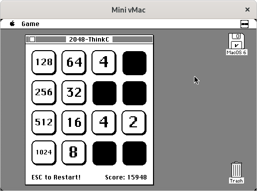
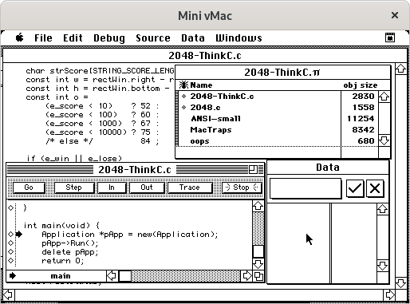
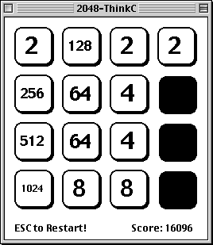

2048-ThinkC
===========



[https://github.com/EXL/2048/tree/master/2048-Carbon/2048-ThinkC](https://github.com/EXL/2048/tree/master/2048-Carbon/2048-ThinkC)

The "2048" game for the [classic Mac OS](https://en.wikipedia.org/wiki/Classic_Mac_OS) platform (System 1-6) with using [Macintosh Toolbox](https://en.wikipedia.org/wiki/Macintosh_Toolbox) and [QuickDraw](https://en.wikipedia.org/wiki/QuickDraw) technologies.

## Setup Mini vMac Development Environment

1. Install [Mac OS System 6](https://winworldpc.com/product/mac-os-0-6/system-6x) into [Mini vMac](https://en.wikipedia.org/wiki/VMac) emulator through [Mini vMac Setup](https://www.emaculation.com/doku.php/mini_vmac_setup) installation guide.
2. Copy [TeachText](https://en.wikipedia.org/wiki/TeachText) application from installation floppy disk to the "System Folder" directory.
3. Install [Symantec THINK C](https://macintoshgarden.org/apps/think-c) IDE using [think_c_5-0-2.zip](https://macintoshgarden.org/sites/macintoshgarden.org/files/apps/think_c_5-0-2.zip) ZIP-archive: unpack it and drag-and-drop floppy disks images into Mini vMac emulator window.

### Symantec THINK C Installation Procedure

1. In the Finder, create a new folder and name it "Development".
2. Insert the "THINK C 2" disk, and double-click on the "Headers & Libs.sea" self-extracting archive.
3. A standard file dialog appears. Move to your "Development" folder and click "Extract" button.
4. Repeat steps 2-4 for the each of the other archives on "THINK C 2", "THINK C 3", and "THINK C 4" disks.
5. Insert "THINK C 1" disk, and move "THINK C 5.0" and "THINK C Debugger 5.0" executable files into the "THINK C 5.0 Folder" in your "Development" folder.

## Build

1. Drag-and-drop "[2048-MAC.dsk](../DiskImages/)" floppy disk image to the Mini vMac emulator window, then copy "2048-ThinkC" folder on the storage drive.
2. Open "2048-ThinkC:2048-ThinkC.π" project file with Symantec THINK C IDE.
3. In the main menu choose "Project" => "Build Application...", then click "Yes" button.
4. Save application as 2048-ThinkC with "Smart Link" option, replace existing file.
5. Get resulted executable file for [Motorola 68000](https://en.wikipedia.org/wiki/Motorola_68000) architecture in the "2048-ThinkC" directory.

### Installing the application icon manually with ResEdit

*Note.* These actions aren't required if you are using "2048-ThinkC.π" project file in the Symantec THINK C IDE. The ResEdit program by Apple located in the "Mac OS 6:Development:THINK C 5.0 Utilities:ResEdit 2.1.1" directory where "Mac OS 6" is the storage drive.

1. Open "2048-ThinkC:2048-ThinkC.π.rsrc" resource file with Apple ResEdit program.
2. In the main menu choose "File" => "Get File/Folder Info...", select 2048-ThinkC executable file and click "Get Info" button.
3. Change "Creator:" field from "????" to "Thnk", unset "Inited" and set "Has BNDL" checkmarks.
4. Close "Info for 2048-ThinkC" window and save changes. These actions will set the icon for the 2048-ThinkC application.

## Additional Information

You can use [ImportFl](https://www.gryphel.com/c/minivmac/extras/importfl/index.html) application to transfer files inside the classic Mac OS. Just drag-and-drop ImportFl image on the Mini vMac emulator window, run "ImportFl" executable file, then drag-and-drop your files and save them on the Mac OS disk.

This repository contains the source files with the Unix **LR** [line breaks](https://en.wikipedia.org/wiki/Newline) for convenience. Don't forget to change line breaks to **CR**, which are used in classic macOS. This can be easily done using the `unix2mac` utility which is included in the "dos2unix" package.

```sh
unix2mac 2048.c
unix2mac 2048.h
unix2mac 2048-Think.c
unix2mac ReadMe.md
unix2mac ExOffScreen/ExOffScreen.c # Optional.
unix2mac ExOffScreen/ReadMe.md     # Optional.
```

The reverse process can be done with `mac2unix` utility.

The [Macintosh Toolbox with THINK C](https://nondisplayable.ca/2018/05/23/what-think-c-doesnt-tell-you.html) manual describes the basics of classic Mac OS System 1-6 programming with using Apple Macintosh Toolbox framework and Symantec THINK C IDE.

The [ExOffScreen](../ExOffScreen) example shows fast offscreen drawing implementation based on the "Flight Simulator" demonstration program by Chris Moll. This helps to avoid screen flickering and visible redrawing of parts of the window.

See [NotesClassicMacOS.md](../../doc/NotesClassicMacOS.md) document for some additional information.

## Classic Mac OS System Development Environment

Symantec THINK C 5.0.2:



Apple ResEdit 2.1.1:


## Versions

1. [Mini vMac 36.04](https://www.gryphel.com/c/minivmac/dnld_std.html)
2. [Apple Mac OS 6.0.8.1 [International]](https://winworldpc.com/download/aa9141cd-d7aa-11e7-a73f-fa163e9022f0)
3. [Symantec THINK C 5.0.2](https://macintoshgarden.org/sites/macintoshgarden.org/files/apps/think_c_5-0-2.zip)
4. [Apple ResEdit 2.1.1](https://en.wikipedia.org/wiki/ResEdit)
5. [ImportFl 1.2.2](https://www.gryphel.com/d/minivmac/extras/importfl/importfl-1.2.2.zip)

## Additional Screenshots

The 2048-ThinkC application running on the classic Mac OS 8.1:

  
