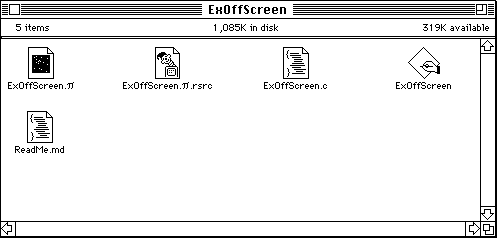
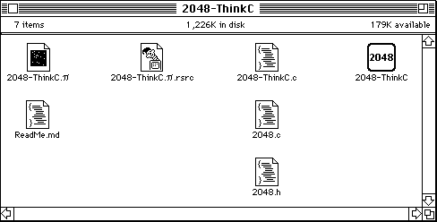
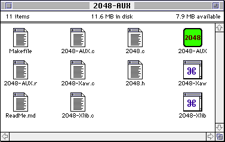
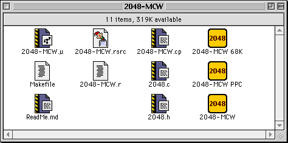
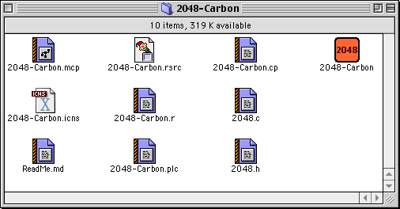

Disk Images
===========

Due to the [resource fork](https://en.wikipedia.org/wiki/Resource_fork) complexity in the file systems of the classic Mac OS it is impossible to distribute programs and files without losing some attributes and important data in some cases e.g. CFM/PEF executables for [Motorola 68000](https://en.wikipedia.org/wiki/Motorola_68000) architecture which store the machine code in a resource forks.

In a computer file system, a [fork](https://en.wikipedia.org/wiki/Fork_(file_system)) is a set of data associated with a file-system object. File systems without forks only allow a single set of data for the contents, while file systems with forks allow multiple such contents.

To prevent the loss of important data, the necessary project files are distributed as a disk images that can be mounted in various emulators.

## 2048-MAC.dsk

The "2048-MAC.dsk" image contains the project files, source code, resources, and executable files for the following classic Mac OS projects:

1. [ExOffScreen](../../2048-Carbon/2048-ThinkC/ExOffScreen/)

    

2. [2048-ThinkC](../../2048-Carbon/2048-ThinkC/)

    

3. [2048-AUX](../../2048-Carbon/2048-AUX/)

    

4. [2048-MCW](../../2048-Carbon/2048-MCW/)

    

5. [2048-Carbon](../../2048-Carbon/)

    
