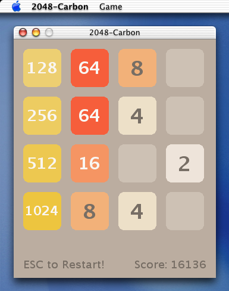

2048-Carbon
===========



Used technologies:

* [Carbon API](https://en.wikipedia.org/wiki/Carbon_(API))
* [Macintosh Toolbox](https://en.wikipedia.org/wiki/Macintosh_Toolbox)
* [QuickDraw](https://en.wikipedia.org/wiki/QuickDraw)
* Precompiled [Resource fork](https://en.wikipedia.org/wiki/Resource_fork) by [Rez compiler and DeRez decompiler](https://en.wikipedia.org/wiki/Resource_fork#Editing_resource_forks) utilites.

Building the program is performed for the PowerPC architecture.

See additional information in [2048-Cocoa](../../2048-Cocoa) project directory.

## Building application via Project Builder

1. Open **2048-Carbon.pbproj** project with Project Builder application.
2. On the **Targets** tab choose **Deployment** Build Style instead of **Development** style.
3. Go to **Build** menu and choose **Build** item.
4. Get the **2048-Carbon.app** application in the **build/** directory after building.

## Share application package

```bash
cd ~/Projects/2048/2048-Carbon/ProjectBuilder/
cd build/
tar -cvf 2048-Carbon.app.tar 2048-Carbon.app
ftp 192.168.122.1
Name (192.168.122.1:happymac): exl
ftp> binary
ftp> passive
ftp> cd /var/ftp/pub/
ftp> put 2048-Carbon.app.tar
```

## Mac OS X Development Environment

Project Builder and Interface Builder: See [2048-Cocoa](../../2048-Cocoa) directory.

## Versions

* Mac OS X 10.0 (Build 4K78)
* Project Builder 1.0 (v57)
* Interface Builder 2.0 (v187)

Compiler on Mac OS X 10.0 and PowerPC platform:

```
cc -v
Reading specs from /usr/libexec/gcc/darwin/ppc/2.95.2/specs
Apple Computer, Inc. version gcc-926, based on gcc version 2.95.2 19991024 (release)
```
