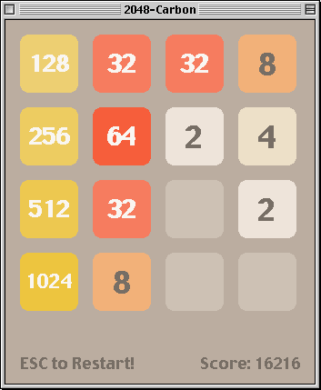
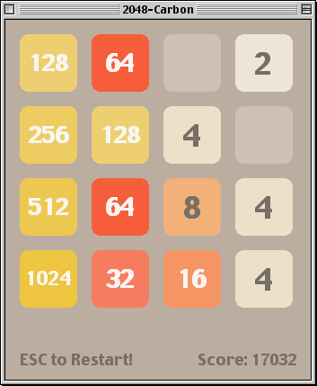
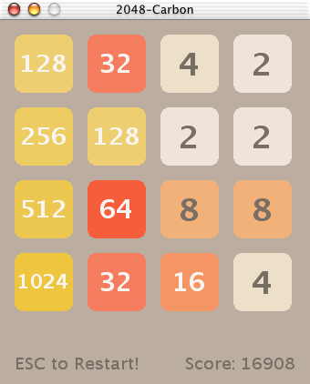

2048-Carbon
===========

| Mac OS 8.6 | Mac OS 9.0.4 | Mac OS X 10.0 |
|------------|--------------|---------------|
|  |  |  |

[https://github.com/EXL/2048/tree/master/2048-Carbon](https://github.com/EXL/2048/tree/master/2048-Carbon)

The "2048" game for the [classic Mac OS](https://en.wikipedia.org/wiki/Classic_Mac_OS) (System 8.6-9) and early [Mac OS X](https://en.wikipedia.org/wiki/MacOS) (10.0-10.6.8) platforms based on [PowerPC](https://en.wikipedia.org/wiki/PowerPC) architecture with using [Carbon API](https://en.wikipedia.org/wiki/Carbon_(API)) which using under the hood [Macintosh Toolbox](https://en.wikipedia.org/wiki/Macintosh_Toolbox) and [QuickDraw](https://en.wikipedia.org/wiki/QuickDraw) technologies.

*Note.* The [QuickDraw GX](https://en.wikipedia.org/wiki/QuickDraw_GX) 2D graphics engine [isn't supported](http://mirror.informatimago.com/next/developer.apple.com/documentation/Carbon/Reference/Carbon_Spec_Porting/QuickDraw_GX.html) in Carbon API.

## Setup Sheep Shaver Development Environment

1. Install [Mac OS 9.0.4](https://winworldpc.com/product/mac-os-9/90) into [Sheep Shaver](https://en.wikipedia.org/wiki/SheepShaver) emulator through [Sheep Shaver Setup](https://www.emaculation.com/doku.php/sheepshaver_setup) installation guide.

    *Note №1.* If you are using Linux, please disable SELinux for the current session and disable `mmap_min_addr` to rid off "Cannot map Low Memory Globals: Operation not permitted." error.

    ```bash
    sudo setenforce 0
    echo 0 | sudo tee /proc/sys/vm/mmap_min_addr
    ```

    *Note №2.* The classic Mac OS installation disks checks the writeability of itself. Disable the ability to write to the image by this command:

    ```bash
    chmod 0444 "Apple MacOS 9.0.4.iso"
    ```

    To rid off "The system software on the startup disk only functions on the original media, not if copied to another drive." error.

2. Install [CodeWarrior Pro 8](https://macintoshgarden.org/apps/codewarrior-pro-8x) Tools and IDE which requires at least 1 GB for installation.

    Be sure to read the "Installation Notes" from "CW Tools 8.0" CD disk before run "Install CodeWarrior 8.0" program.

    1. Go to the "CW Tools 8.0:System Folder Items:For Classic Mac OS Development:INTO System Folder" directory.
    2. Copy the "MacsBugs" program to the "Mac OS 9:System Folder" directory by drag and drop.
    3. Copy all other files from CD to their respective system directories in the same way.
    4. Reboot machine and now you can run "Install CodeWarrior 8.0" program without these errors:

    ```
    Illegal instruction at 40810000, opcode = 4cdf1808
    Illegal instruction at 40810004, opcode = 4e7591c8
    Illegal instruction at 40810018, opcode = 00184a42
    Illegal instruction at 40810024, opcode = 00000000
    Illegal instruction at 40810028, opcode = 00000000
    Illegal instruction at 4081002c, opcode = 00000000
    Illegal instruction at 40810030, opcode = 4e56ffe0
    Segmentation fault
    ```

    *Note.* The "Mac OS 9" is name of storage drive with installed Mac OS 9.

3. Install [ResEdit 2.1.3](https://macintoshgarden.org/apps/resedit) by Apple. [ResEdit](https://en.wikipedia.org/wiki/ResEdit) is a developer tool application for the Apple Macintosh, used to create and edit resources directly in the Mac's [resource fork](https://en.wikipedia.org/wiki/Resource_fork) architecture.

4. *Optional.* Update [CarbonLib extension](https://macintoshgarden.org/apps/carbonlib) to 1.6.1 version.

5. *Optional.* Install [Iconographer 2.4](https://macintoshgarden.org/apps/iconographer-24) to for [\*.icns](https://en.wikipedia.org/wiki/Apple_Icon_Image_format) icons editing capability.

## Building CFM/PEF executable using Metrowerks CodeWarrior IDE in Mac OS 9

1. Attach "[2048-MAC.dsk](./DiskImages/)" floppy disk image on "Volumes" tab in the Sheep Shaver emulator and start Mac OS 9 with it.
2. Copy "2048-Carbon" folder from floppy disk to the storage drive.
3. Open "2048-Carbon:2048-Carbon.mcp" project file with Metrowerks CodeWarrior IDE.
4. Set "Carbon Toolbox Final" instead of "Carbon Toolbox Debug" target.
5. In the main menu choose "Project" => "Make", wait for the compilation process to complete.
6. Get resulted 2048-Carbon executable file for [PowerPC](https://en.wikipedia.org/wiki/PowerPC) architecture in the "2048-Carbon" directory.

## Building Mach-O executable using Project Builder IDE in Mac OS X

See [ProjectBuilder](./ProjectBuilder/) directory.

## Additional Information

This repository contains the source files with the Unix **LR** [line breaks](https://en.wikipedia.org/wiki/Newline) for convenience. Don't forget to change line breaks to **CR**, which are used in classic macOS. This can be easily done using the `unix2mac` utility which is included in the "dos2unix" package.

```sh
unix2mac 2048.c
unix2mac 2048.h
unix2mac 2048-Carbon.cp
unix2mac 2048-Carbon.r
unix2mac 2048-Carbon.plc
unix2mac ReadMe.md
```

The reverse process can be done with `mac2unix` utility.

Useful Carbon API code examples:

1. [BitPaint](https://github.com/steventroughtonsmith/BitPaint/) -- Trivial Carbonized Toolbox sample project that runs on Mac OS System 1.0 right up to Mac OS X 10.10 and higher.
2. [MoreIsBetter](http://mirror.informatimago.com/next/developer.apple.com/samplecode/MoreIsBetter/index.html) -- A code sample and library which provides indispensable work-arounds and illustrations for Mac OS programming. This library was helpful for implementation of movable modal dialogs.

See [NotesClassicMacOS.md](../../doc/NotesClassicMacOS.md) document for some additional information.

## Classic Mac OS Development Environment

Metrowerks CodeWarrior IDE 5.0 (part of Metrowerks CodeWarrior Pro 8 distribution):


## Versions

1. [Sheep Shaver 2.4](https://github.com/cebix/macemu) | [Sheep Shaver 2.5](https://github.com/kanjitalk755/macemu)
2. [Apple Mac OS 9.0.4](https://winworldpc.com/download/3e3dc387-c38b-18c3-9a11-c3a4e284a2ef)
3. [Metrowerks CodeWarrior Pro 8](https://macintoshgarden.org/sites/macintoshgarden.org/files/apps/CodeWarrior_8_Pro.toast_.sit) (with Metrowerks CodeWarrior IDE version 5.0 build 951)
4. [Apple ResEdit 2.1.3](https://macintoshgarden.org/sites/macintoshgarden.org/files/apps/ResEdit.sit)
5. [CarbonLib 1.6.1](https://macintoshgarden.org/sites/macintoshgarden.org/files/apps/CarbonLib_161.sit)
6. [Iconographer 2.4](https://macintoshgarden.org/sites/macintoshgarden.org/files/apps/iconographer24.sit)
