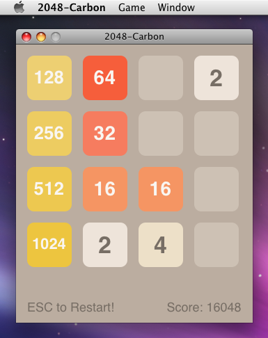

2048-Carbon
===========



Used technologies:

* [Carbon API](https://en.wikipedia.org/wiki/Carbon_(API))
* [Quartz 2D](https://en.wikipedia.org/wiki/Quartz_2D)/[Core Graphics](https://en.wikipedia.org/wiki/Quartz_(graphics_layer))
* HIView from [HIToolbox](http://mirror.informatimago.com/next/developer.apple.com/carbon/HIToolbox_feature.html)
* XIB from [Interface Builder](https://en.wikipedia.org/wiki/Interface_Builder#Design)

Building the program is performed for the following architectures:

* x86 (i386)
* ppc

## Building application via Xcode 3

1. Open **2048-Carbon.xcodeproj** project.
2. Choose **Project** => **Set Active Build Configuration** => **Release** in the global menu then choose **Build** => **Clean All Targets** and then click **Clean** button.
3. Choose **Build** => **Build** menu item.
4. Get **2048-Carbon.app** package from **build/Release/** directory.

## Building application via Command-Line tools

```bash
git clone https://github.com/EXL/2048
cd 2048/2048-Carbon/Xcode3/

xcodebuild clean install
cd /tmp/2048-Carbon.dst/Users/$USER/Applications/
tar -cvf 2048-Carbon.app.tar 2048-Carbon.app
mv 2048-Carbon.app.tar ~/Projects/
cd ~/Projects/
tar -xvf 2048-Carbon.app.tar
rm 2048-Carbon.app.tar
```

Get **2048-Carbon.app** package from `~/Projects/` directory.

## Mac OS X Development Environment

Xcode 3 and Interface Builder 3: See [2048-Cocoa/Xcode3](../../2048-Cocoa/Xcode3) directory.

## Versions

* Mac OS X 10.5.8 (Build 9L31a)
* Xcode 3.1.4

    * Xcode IDE: 1203.0
    * Xcode Core: 1204.0
    * ToolSupport: 1186.0

* Interface Builder 3.1.4 (680)

Compiler on Mac OS X 10.5.8 and x86/x86_64 platform:

```
cc -v
Using built-in specs.
Target: i686-apple-darwin9
Configured with: /var/tmp/gcc/gcc-5493~1/src/configure --disable-checking -enable-werror --prefix=/usr --mandir=/share/man --enable-languages=c,objc,c++,obj-c++ --program-transform-name=/^[cg][^.-]*$/s/$/-4.0/ --with-gxx-include-dir=/include/c++/4.0.0 --with-slibdir=/usr/lib --build=i686-apple-darwin9 --with-arch=apple --with-tune=generic --host=i686-apple-darwin9 --target=i686-apple-darwin9
Thread model: posix
gcc version 4.0.1 (Apple Inc. build 5493)
```
