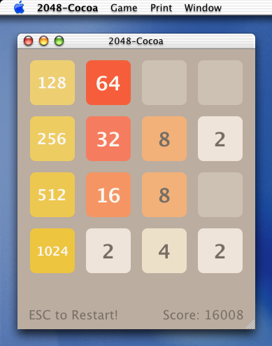
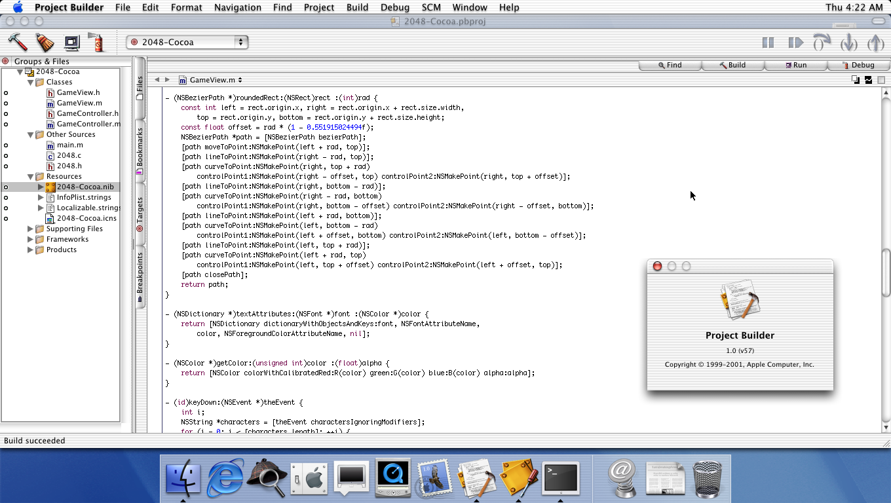

2048-Cocoa
==========



## Developer Tools

Install Developer Tools for Mac OS X 10.0 from **Developer Tools 10.0.dmg** image.

## Build & Run

1. Open **2048-Cocoa.pbproj** project with Project Builder application.
2. Go to **Build** menu and choose **Build and Run** item.

## Deploy Application

1. Open **2048-Cocoa.pbproj** project with Project Builder application.
2. On the **Targets** tab choose **Deployment** Build Style instead of **Development** style.
3. Go to **Build** menu and choose **Build** item.
4. Get the **2048-Cocoa.app** application in the **build/** directory after building.

## FTP Client Commands

Use FTP client for transfer files between host and guest systems.

```tcsh
tar -cvf 2048-Cocoa.app.tar 2048-Cocoa.app/
ftp 192.168.122.1
Name (192.168.122.1:happymac): anonymous
ftp> binary
ftp> passive
ftp> ls
ftp> cd pub/
ftp> put 2048-Cocoa.app.tar
ftp> get 2048.tar.gz
```

## Change Defaults Commands

```tcsh
defaults
defaults domains
defaults read ru.exlmoto.Cocoa2048
defaults write ru.exlmoto.Cocoa2048 roundedTiles -bool NO
defaults delete ru.exlmoto.Cocoa2048
```

## Mac OS X Development Environment

Project Builder:



Interface Builder:


## Versions

* Mac OS X 10.0 (Build 4K78)
* Project Builder 1.0 (v57)
* Interface Builder 2.0 (v187)

Compiler on Mac OS X 10.0 and PowerPC platform:

```
cc -v
Reading specs from /usr/libexec/gcc/darwin/ppc/2.95.2/specs
Apple Computer, Inc. version gcc-926, based on gcc version 2.95.2 19991024 (release)
```
