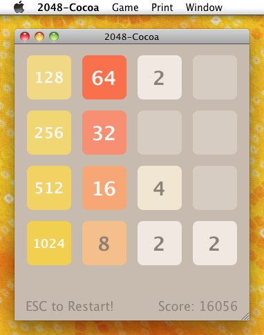
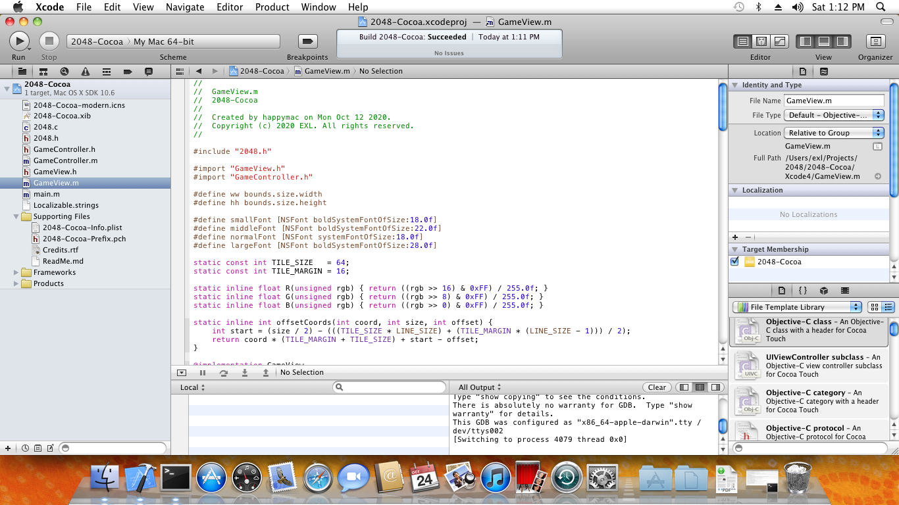
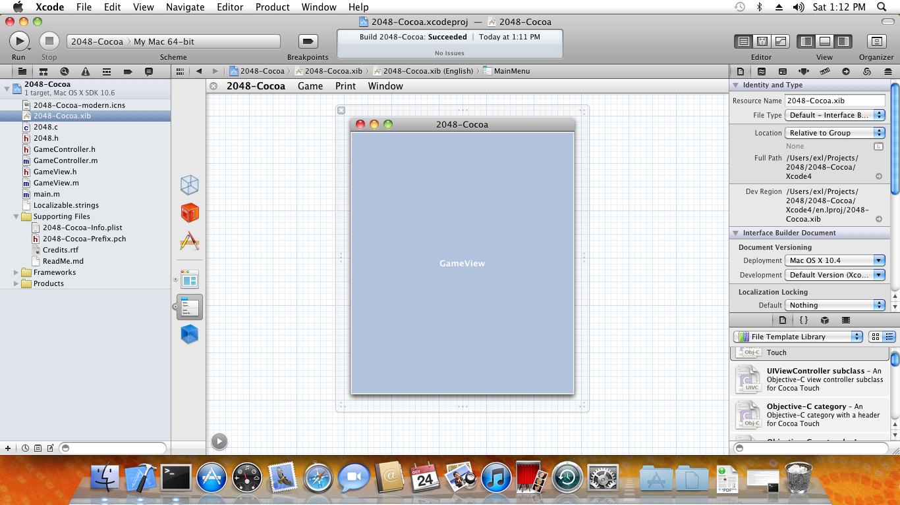

2048-Cocoa
==========



## Building application via Xcode 4

1. Open **2048-Cocoa.xcodeproj** project.
2. Choose **Product** => **Clean** in the global menu then choose **Product** => **Archive** item.
3. Select in the window that opens **Share...** button.
4. Choose **Contents:** => **Application** option then click **Next** button and set directory for saving.
5. Get **2048-Cocoa.app** package from selected directory.

## Building application via Command-Line tools

```bash
git clone https://github.com/EXL/2048
cd 2048/2048-Cocoa/Xcode4

xcodebuild -scheme 2048-Cocoa clean install DSTROOT=`pwd`
```

Get **2048-Cocoa.app** package from `2048-Cocoa/Xcode4/Applications` directory.

## OS X Development Environment

Xcode 4:





## Versions

* Mac OS X 10.6.8 (Build 10K549)
* Xcode 4.2 (Build 4C199)

Compiler on Mac OS X 10.6.8 and x86/x86_64 platform:

```
clang -v
Apple clang version 3.0 (tags/Apple/clang-211.10.1) (based on LLVM 3.0svn)
Target: x86_64-apple-darwin10.8.0
Thread model: posix
```
