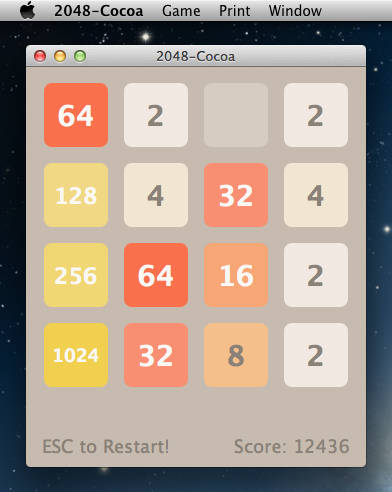

2048-Cocoa
==========



## Building application via Xcode 5

1. Open **2048-Cocoa.xcodeproj** project.
2. Choose **Product** => **Clean** in the global menu then choose **Product** => **Archive** item.
3. Select in the window that opens **Distribute...** button.
4. Choose **Export as** => **Application** option then click **Export** button and set directory for saving.
5. Get **2048-Cocoa.app** package from selected directory.

## Building application via Command-Line tools

```bash
git clone https://github.com/EXL/2048
cd 2048/2048-Cocoa/Xcode5

xcodebuild -scheme 2048-Cocoa clean archive -archivePath 2048-Cocoa
xcodebuild -exportArchive -archivePath 2048-Cocoa.xcarchive -exportPath '2048-Cocoa.app' -exportFormat app
```

## OS X Development Environment

Xcode 5:


## Versions

* OS X 10.8.5 (Build 12F37)
* Xcode 5.1.1 (Build 5B1008)

Compiler on OS X 10.8.5 and x86_64 platform:

```
`xcodebuild -find cc` -v
Apple LLVM version 5.1 (clang-503.0.40) (based on LLVM 3.4svn)
Target: x86_64-apple-darwin12.5.0
Thread model: posix
```
