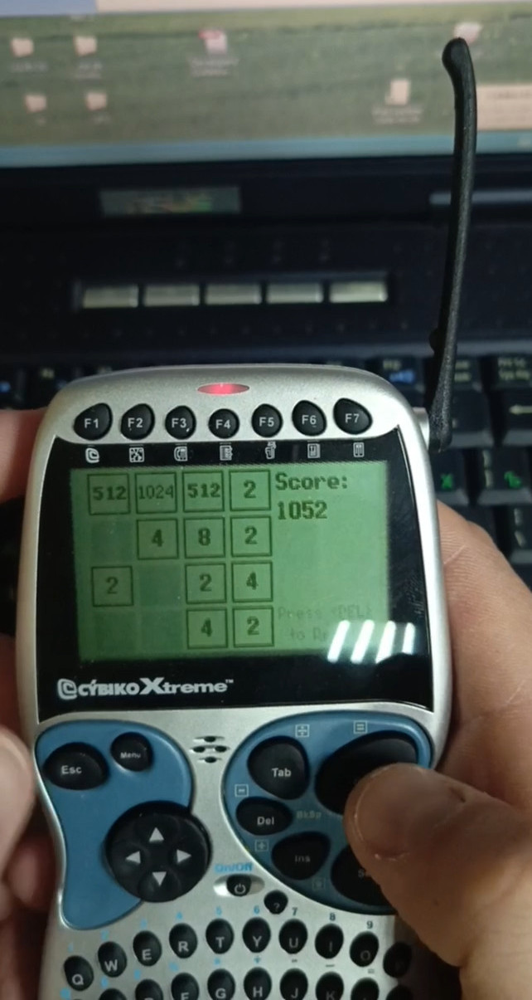
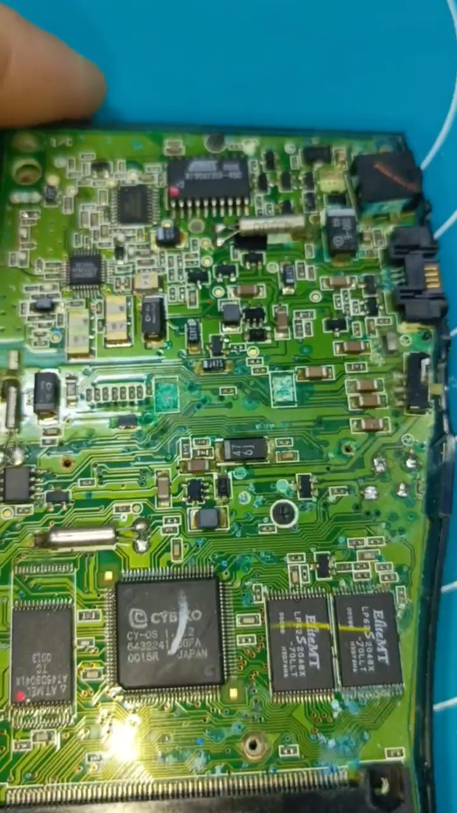

2048-CyOS
=========

The Cybiko is a line of personal digital assistants and handheld game consoles first released by Cybiko Inc. in 2000. Cybiko handhelds work on the CyOS platform. Founded in 1998 in Lund, Sweden. Cybiko Inc. was a startup company founded by David Yang; the eponymous PDA was first test marketed in New York in April 2000 and rolled out nationwide in May 2000.


| Device         | CPU                              | Coprocessor             | RAM     | ROM     | LCD                   |
|----------------|----------------------------------|-------------------------|---------|---------|-----------------------|
| Cybiko Classic | Hitachi H8S/2241 @ 11.0592 MHz   | Atmel AT90S2313 @ 4 MHz | 512 KiB | 512 KiB | 160x100, 2bpp, 4 gray |
| Cybiko Xtreme  | Hitachi H8S/2323 @ 18 MHz        | Atmel AT90S2313 @ 4 MHz | 1.5 MiB | 512 KiB | 160x100, 2bpp, 4 gray |



*Thanks SHBEN (@SHU8IT) for this photo.*

## Cybiko SDK Pro

Download [SDKPro_3012.exe](http://www.piclist.com/images/cybiko/SDKPro_3012.exe) intstaller, then install SDK on Oracle VM VirtualBox or VMWare Workstation Player with Windows 2000 or Windows XP.

## Prepare

Copy **2048-CyOS** directory to the Windows developer workstation.

```sh
cd 2048
tar hcvf 2048-CyOS.tar 2048-CyOS
```

The `2048-CyOS.tar` archive will contain all files instead of symlinks.

## Build application for Cybiko Classic and Cybiko Xtreme

```bat
vmake clean
make
```

Get `2048-CyOS.app` (Classic) and `2048-CyOS_X.app` (Xtreme) application versions from the root project directory and place it on the device.

## Hardware



* Cybiko CY-OS 1.2.2 HD6432241: A custom Renesas H8S/2245 @ 11.0592 MHz CPU by Cybiko.
* Atmel AT90S2313-4SC: Coprocessor
* AMIC/EliteMT LP62S2048X-70LLT x2: 256 KiB SRAM
* Atmel AT45DB041A

Thanks to **SHBEN** for the photos.

## C-Pen Development Environment

## Versions

* vcc 3.1.4

```
>vcc
Cybiko C Compiler 3.1.4.
Copyright (C) 2000, 2001 Cybiko, Inc.
```

## Thanks

* SHBEN (@SHU8IT)
* Alexander (@sashapont)

## Archive Links

* http://www.piclist.com/techref/cybiko/sdkpro.htm
* https://archive.org/details/cybiko
* https://archive.org/details/cybiko-files
* https://www.dbzoo.com/cybiko/cybiko
* https://archive.org/details/gamedevelopersgu0000paze
* https://www.schuerewegen.tk/cybiko/emu/cybiko_xtreme/
* https://www.schuerewegen.tk/cybiko/emu/cybiko_classic_v2/
