2048-EZX
========

The "2048" game for the EZX OS by Motorola.

*Motorola ROKR E6 Screenshots:*

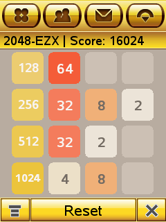 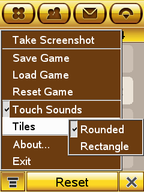 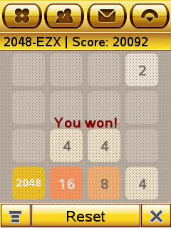 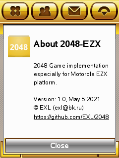

*Motorola ROKR E2 Screenshots:*

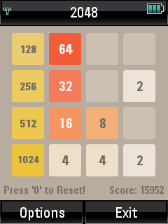 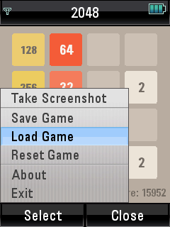 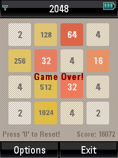 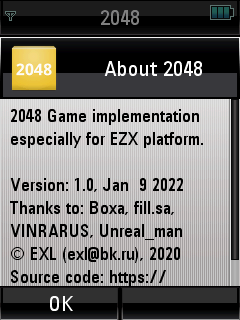

*Motorola E680i Screenshots:*

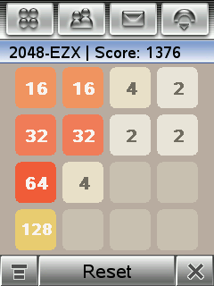 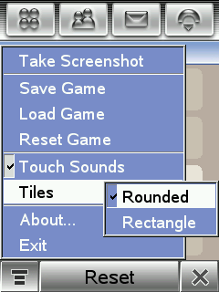 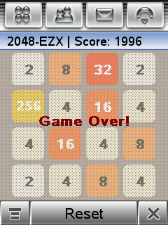 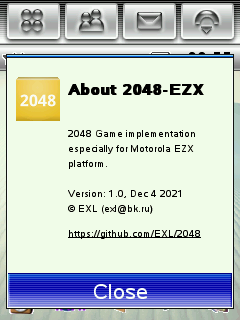

*Motorola E680 Screenshots:*

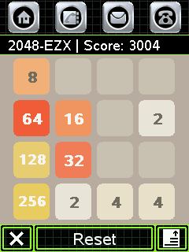 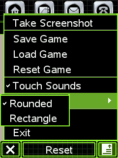 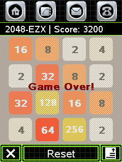 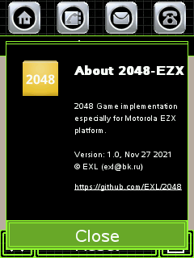

## Toolchain & SDK

Motorola A1200, E6, E2: // TODO: Add normal link mirrored to forum.motofan.ru

Motorola A780, E680i: // TODO: Add normal link mirrored to forum.motofan.ru

Download MotoEZX Toolchains & SDK from [this link](http://www.mediafire.com/?meqnmgujgjq).

Download E680i Toolchains & SDK from [this link](https://code.google.com/archive/p/moto-e680-develop/downloads).

## Install Tools & Build

CentOS 7 General Prepare Recipe:

```sh
sudo yum -y install epel-release

sudo yum -y install @development
sudo yum -y install glibc.i686 libstdc++.i686
sudo yum -y install p7zip

cd ~/Projects/
git clone https://github.com/EXL/2048
```

Install MotoEZX Toolchains & SDK for A1200, E6, E2:

```sh
sudo mkdir -p /opt/toolchains/
sudo tar -C /opt/toolchains/ -xzvf ~/Downloads/motoezx-toolchains*.tar.gz*
```

Install MotoEZX Toolchains & SDK for A780, E680i:

```sh
sudo mkdir -p /opt/toolchains/
sudo tar -C /opt/toolchains/ -xzvf ~/Downloads/motoe680-toolchains*.tar.gz*
sudo ln -s /opt/toolchains/motoe680 /usr/local/arm
```

Build for A1200, E6:

```sh
cd ~/Projects/2048/2048-EZX/
. /opt/toolchains/motoezx/setenv-a1200-devezx.sh
make clean
make
make mpkg
```

Build for E2:

```sh
cd ~/Projects/2048/2048-EZX/
. /opt/toolchains/motoezx/setenv-e2.sh
make -f Makefile.e2 clean
make -f Makefile.e2
make -f Makefile.e2 mpkg
```

Build for A780, E680i:

```sh
cd ~/Projects/2048/2048-EZX/
. /opt/toolchains/motoe680/setenv-e680.sh
make -f Makefile.e680i clean
make -f Makefile.e680i
make -f Makefile.e680i mpkg
```

Build for A760, E680:

```
cd ~/Projects/2048/2048-EZX/
. /opt/toolchains/motoe680/setenv-e680.sh
make -f Makefile.e680 clean
make -f Makefile.e680
make -f Makefile.e680 mpkg
```

## Copy executable file to A1200, E6, E2 and run it

FTP:

```sh
ftp 192.168.16.2
User: ezx
ftp> binary
ftp> cd /mmc/mmca1/
ftp> put 2048-EZX
ftp> quit
```

Telnet:

```sh
telnet 192.168.16.2
User: root
# cd /mmc/mmca1/
# . /home/native/.profile
# ./2048-EZX
```

## Create project file and Makefile

*Note.* This step is optional and is presented simply as an example of creating project and building files. This project contains ready-to-build generated Makefile and project files, so this section can be skipped.

Generate project and building files for A1200, E6:

```sh
cd ~/Projects/2048/2048-EZX/
mkdir -p 2048-EZX-E6-Project
cd 2048-EZX-E6-Project/
cp ../2048-EZX.cpp .
cp ../../src/2048.* .
. /opt/toolchains/motoezx/setenv-a1200-devezx.sh
progen CONFIG+=thread -o 2048-EZX_E6.pro
tmake 2048-EZX_E6.pro -o Makefile.e6
make -f Makefile.e6 clean
make -f Makefile.e6
```

Generate project and building files for E2:

```sh
cd ~/Projects/2048/2048-EZX/
mkdir -p 2048-EZX-E2-Project
cd 2048-EZX-E2-Project/
cp ../2048-EZX_E2.cpp .
cp ../../src/2048.* .
. /opt/toolchains/motoezx/setenv-e2.sh
progen CONFIG+=thread -o 2048-EZX_E2.pro
tmake 2048-EZX_E2.pro -o Makefile.e2
make -f Makefile.e2 clean
make -f Makefile.e2
```

Generate project and building files for A780, E680i:

```sh
cd ~/Projects/2048/2048-EZX/
mkdir -p 2048-EZX-E680I-Project
cd 2048-EZX-E680I-Project/
cp ../2048-EZX.cpp .
cp ../../src/2048.* .
. /opt/toolchains/motoe680/setenv-e680.sh
progen CONFIG+=thread -o 2048-EZX_E680I.pro
tmake 2048-EZX_E680I.pro -o Makefile.e680i
make -f Makefile.e680i clean
make -f Makefile.e680i
```

Generate project and building files for A760, E680:

```sh
cd ~/Projects/2048/2048-EZX/
mkdir -p 2048-EZX-E680-Project
cd 2048-EZX-E680-Project/
cp ../2048-EZX.cpp .
cp ../../src/2048.* .
. /opt/toolchains/motoe680/setenv-e680.sh
progen CONFIG+=thread -o 2048-EZX_E680.pro
tmake 2048-EZX_E680.pro -o Makefile.e680
make -f Makefile.e680 clean
make -f Makefile.e680
```

## Additional Stuff

EZX OS screenshots from Motorola ROKR E6:

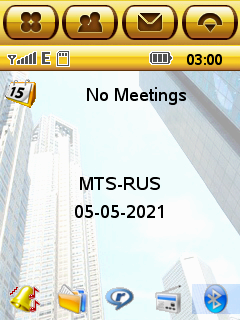 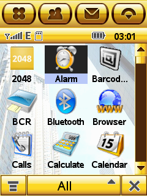 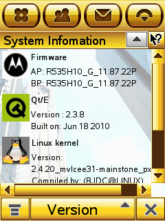 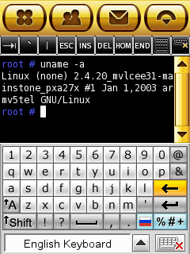

EZX OS screenshots from Motorola ROKR E2:

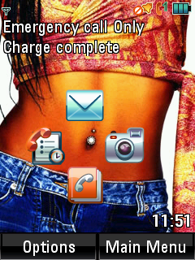 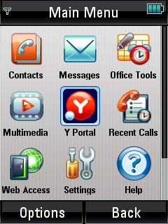 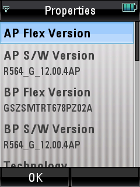 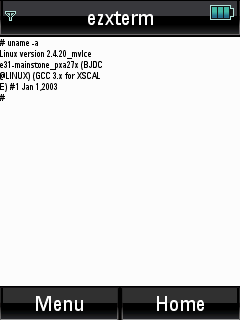

EZX OS screenshots from Motorola E680i:

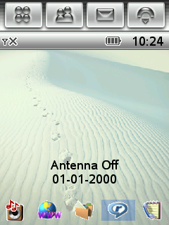 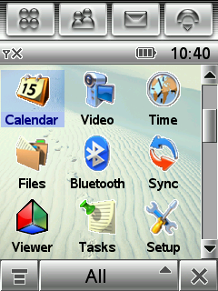 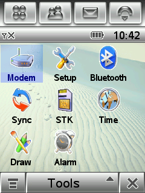 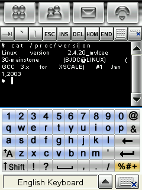

EZX OS screenshots from Motorola E680:

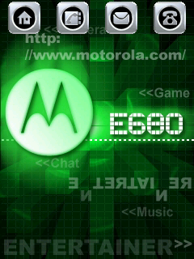 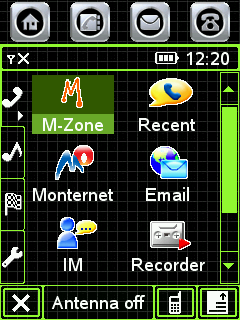 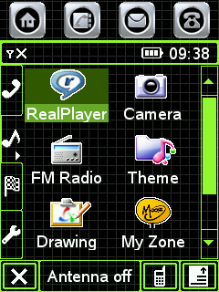 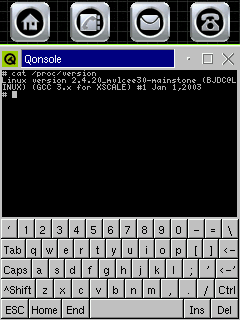

2048-EZX running on Motorola ROKR E6:

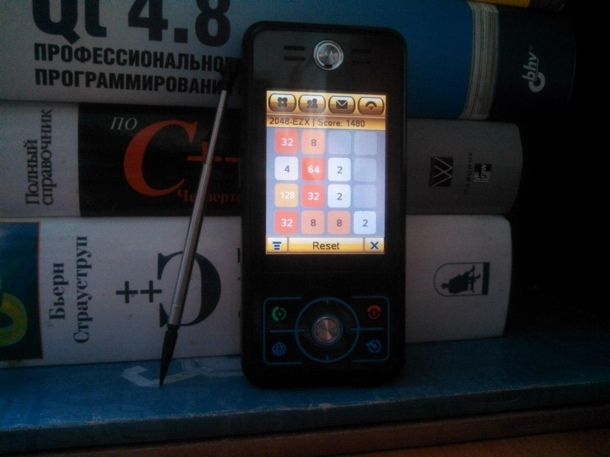

2048-EZX running on Motorola ROKR E2 (thanks to [Unreal_man](https://github.com/KathyTi) for the photo):

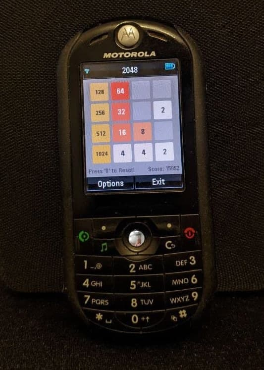

2048-EZX running on Motorola E680 (thanks to [Boxa](https://github.com/Voha888) for the photo):

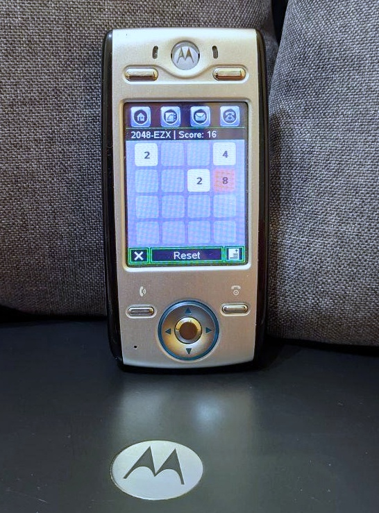

## Remote development and testing

Thanks to [Boxa](https://github.com/Voha888)'s help it was possible to make port of "2048" game to the Motorola E680 that he had. Boxa set up a remote session for me via AnyDesk and a webcam on a computer with Windows XP, since this operating system was required to be able to use Telnet & Samba on the Motorola E680.

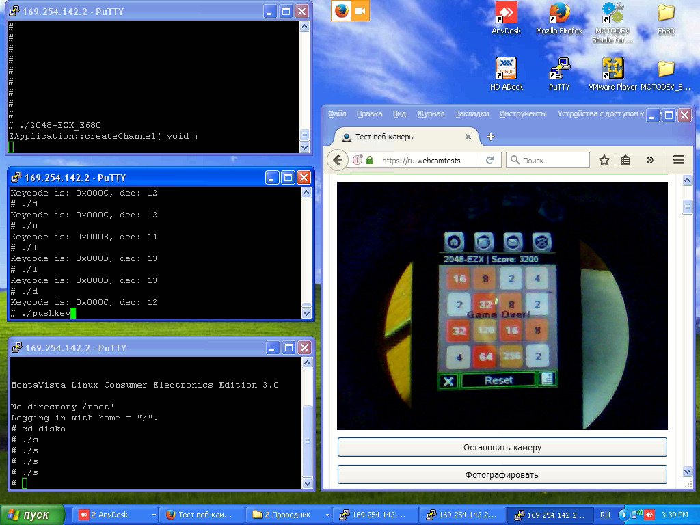

The emulation of button presses on the phone is done using my [pushkey](https://github.com/EXL/keyd/tree/master/pushkey) program which I make for MotoMAGX in the first place. I used the [fb2bmp](https://github.com/iven/e680_fb2bmp) program by [Iven](https://github.com/iven) to take screenshots from device. I was able to test and debug the project remotely on Motorola E680 thanks to this setup.

## Versions

Any Linux distro with support for running 32-bit x86 applications and tools required.

Compiler for A1200, E6, E2:

```sh
arm-linux-gnu-gcc --version | head -1
arm-linux-gnu-gcc (GCC) 3.3.6

arm-linux-gnu-g++ --version | head -1
arm-linux-gnu-g++ (GCC) 3.3.6
```

Compiler for A780, E680i:

```sh
arm-linux-gcc --version | head -1
arm-linux-gcc (GCC) 3.3

arm-linux-g++ --version | head -1
arm-linux-g++ (GCC) 3.3
```

Qt Embedded version 2.3.6/2.3.8

## Information

* [NotesMotoEZX.md](../doc/NotesMotoEZX.md) document contains additional information about porting and SDK patches.
* [NotesMotoEZX-E680.md](../doc/NotesMotoEZX-E680.md) document contains additional information about Motorola E680.
* [NotesMotoEZX-E680i.md](../doc/NotesMotoEZX-E680i.md) document contains additional information about Motorola E680i.
* [NotesMotoEZX-E2.md](../doc/NotesMotoEZX-E2.md) document contains additional information about Motorola ROKR E2.
