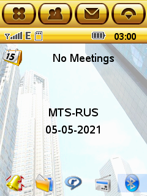
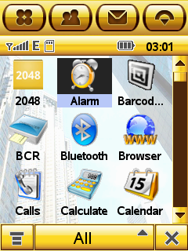
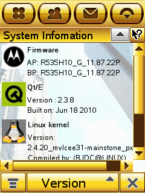

2048-EZX
========

   

The "2048" game for the EZX OS by Motorola.

## Toolchain & SDK

// TODO: Add normal link mirrored to forum.motofan.ru

Download MotoEZX Toolchains & SDK from [this link](http://www.mediafire.com/?meqnmgujgjq).

## Install Tools & Build

CentOS 7 Recipe:

```sh
sudo yum -y install epel-release

sudo yum -y install @development
sudo yum -y install glibc.i686 libstdc++.i686
sudo yum -y install p7zip

sudo mkdir /opt/toolchains/
sudo tar -C /opt/toolchains/ -xzvf ~/Downloads/motoezx-toolchains*.tar.gz*

cd ~/Projects/
git clone https://github.com/EXL/2048
cd 2048/2048-EZX/
. /opt/toolchains/motoezx/setenv-a1200-devezx.sh
make clean
make
```

## Copy executable file to Motorola E6 and run it

FTP:

```sh
ftp 192.168.16.2
User: ezx
ftp> binary
ftp> cd /mmc/mmca1/
ftp> put 2048-EZX
ftp> quit
```

Telnet:

```sh
telnet 192.168.16.2
User: root
# cd /mmc/mmca1/
# . /home/native/.profile
# ./2048-EZX
```

## Create PKG-package for Motorola E6

Method №1:

```sh
cd ~/Projects/2048/2048-EZX/
make pkg
```

Method №2:

```sh
cd ~/Projects/2048/
./util/build_pkg_a1200_e6_package.sh
```

## Create project file and Makefile

*Note.* This step is optional and is presented simply as an example of creating project and building files. This project contains ready-to-build generated Makefile and project files, so this section can be skipped.

First patch `tmake` utility configuration file in MotoEZX Toolchains & SDK:

```sh
cd /opt/toolchains/motoezx/a1200/qt2/tmake/lib/qws/linux-gnu-ezx-g++/
cp tmake.conf tmake.conf.orig
sed -i '/TMAKE_INCDIR_QT/ s/$/ \$\(EZXDIR\)\/include/' tmake.conf
sed -i '/TMAKE_LFLAGS\s/ s/$/,-rpath-link,\$\(EZXDIR\)\/lib/' tmake.conf
sed -i '/TMAKE_LIBS\s/ s/$/-L\$\(EZXDIR\)\/lib -L\$\(EZXDIR\)\/lib\/ezx\/lib -lezxappbase/' tmake.conf
```

Then create necessary files by `progen` and `tmake` utilities:

```sh
cd ~/Projects/2048/2048-EZX/
. /opt/toolchains/motoezx/setenv-a1200-devezx.sh
cp ../src/2048.* .
progen CONFIG+=thread -o 2048-EZX.pro
tmake 2048-EZX.pro -o Makefile.ezx
make -f Makefile.ezx clean
make -f Makefile.ezx
```

## Additional Stuff

   


## Versions

Any Linux distro with support for running 32-bit x86 applications and tools.

```sh
arm-linux-gnu-gcc --version | head -1
arm-linux-gnu-gcc (GCC) 3.3.6

arm-linux-gnu-g++ --version | head -1
arm-linux-gnu-g++ (GCC) 3.3.6
```

Qt Embedded version 2.3.6/2.3.8

## Information

Additional information about porting in [NotesMotoEZX.md](../doc/NotesMotoEZX.md) document file.
