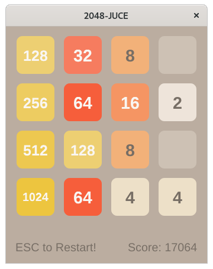
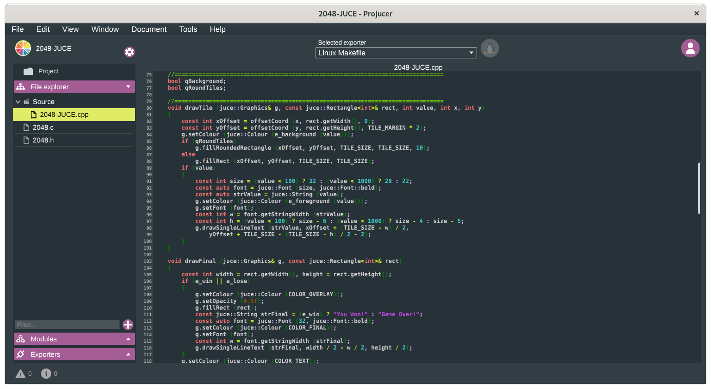

2048-JUCE
=========



## Install JUCE framework

Download JUCE Framework archive from [GitHub releases](https://github.com/juce-framework/JUCE/releases), unpack it, and run the **Projucer** application.

```sh
cd Downloads/
unzip juce-*-linux.zip
cd JUCE/
./Projucer
```

Go to "File" => "Global Paths..." then set "Path to JUCE" and "JUCE Modules" to `~/Downloads/JUCE/` and `~/Downloads/JUCE/modules/` directories.

Click "Re-scan JUCE Modules" and close "Global Paths" window.

Go to "File" => "Open..." and choose `~/Projects/2048/2048-JUCE/2048-JUCE.jucer` project and then click "File" => "Save Project" for regenerating project and building files.

## Build & Run

Fedora 32 Recipe:

```sh
sudo dnf install -y @'Development Tools'
sudo dnf install -y gcc-c++ freetype-devel curl-devel libX11-devel libXrandr-devel libXinerama-devel libXcursor-devel

cd ~/Projects/
git clone https://github.com/EXL/2048
cd 2048/2048-JUCE/Builds/LinuxMakefile
make CONFIG=Release V=1
strip -s build/2048-JUCE
./build/2048-JUCE
```

## JUCE Development Environment

Projucer application:



## Cross compiling

You can use **Projucer** application for generating projects for various platforms. See "Exporters" side panel and click "+" button.

## Versions

* JUCE v6.0.1
* Projucer 6.0.1
* Build date: 7 Jul 2020

```
gcc --version | head -1
gcc (GCC) 10.2.1 20200723 (Red Hat 10.2.1-1)

g++ --version | head -1
g++ (GCC) 10.2.1 20200723 (Red Hat 10.2.1-1)
```
