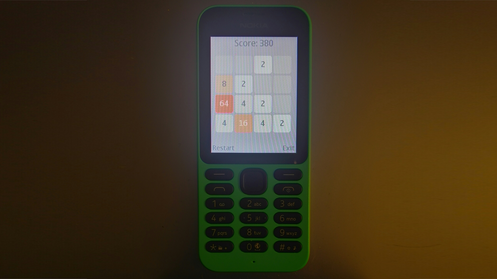

2048-MRE
========

2048 for [MediaTek MRE](https://lpcwiki.miraheze.org/wiki/MAUI_Runtime_Environment) feature phones, written using C, MRE APIs, and [MRE Makefile](https://github.com/gtrxAC/mre-makefile) (open source replacement for MRE SDK). Designed for portrait orientation displays, but should support most phones with MRE 2.5 or above. Ported by [gtrxAC](https://github.com/gtrxAC).

## Build & Run

1. Clone the [MRE Makefile](https://github.com/gtrxAC/mre-makefile) repository to your computer.
2. Copy the `sdk/` folder from the MRE Makefile project into the 2048-MRE folder. These files are not included in the 2048 repo due to possible licensing issues.
3. Run `make setup; make` from a terminal.
4. **Skip this step if you're not using Series 30+.** You'll need to sign the VXP file to your SIM card's IMSI. There are many ways to find your IMSI, [here](https://github.com/raspiduino/mre-sdk/discussions/1#discussioncomment-3571276) is one. Insert the IMSI and VXP into [this tool](https://vxpatch.luxferre.top/).
5. Send the resulting VXP file to a MRE capable phone and open it from the file manager. 