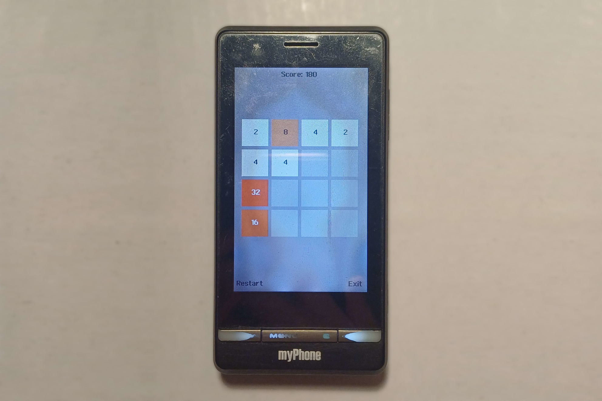

2048-MRP
========

2048 for [MRP (Mythroad)](https://lpcwiki.miraheze.org/wiki/Mythroad) feature phones. Ported by [gtrxAC](https://github.com/gtrxAC).

## Build & Run

1. Download the latest release of [mrpbuilder](https://github.com/vmrp/mrpbuilder/releases/latest) to your computer.
2. Extract the mrpbuilder package and copy the `header/` and `lib/` folders and the `mrp.exe` file into the 2048-MRP folder. These files are not included in the 2048 repo due to possible licensing issues.
3. Run `make` and `mrp.exe` to build the project. On Linux, you can use Wine to run the EXE.
4. Run the app either by using the vmrp emulator or by transferring the MRP file to your device - see below.

### How to run on vmrp

1. Press the button on the bottom of the page (Import file)
2. To refresh the app list, select the first app and close it:
    1. Press the left softkey twice and wait.
    2. Press left softkey, up, and left softkey twice, and wait.
3. Select 2048 and launch it.

### How to run on a real device

1. If you haven't already set up Mythroad on your device:
    1. Check if your device supports Mythroad. You may be able to find some mentions of your device on, for example, the [4PDA thread](https://4pda.to/forum/index.php?showtopic=501783) or on [LPCwiki](https://lpcwiki.miraheze.org/wiki/Main_Page), but in many cases you'll have to try yourself by following these steps. Most Mythroad-capable devices were released around the late 2000s and early 2010s in countries like China and Russia.
    2. Download the [dsm_gm.mrp](https://github.com/vmrp/mythroad/raw/refs/heads/master/DSM_GM.mrp) file and transfer it to the `mythroad` folder in the root of your device's SD card.
2. Transfer the `2048.mrp` file to the `mythroad` folder in the root of your device's SD card.
3. Dial the number `*#220807#` and select 2048. On some devices, the Mythroad menu (usually called Game Center) may instead be accessible normally from the device's menus.