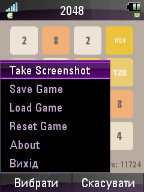
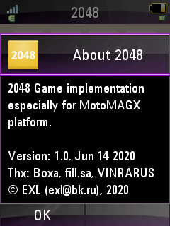
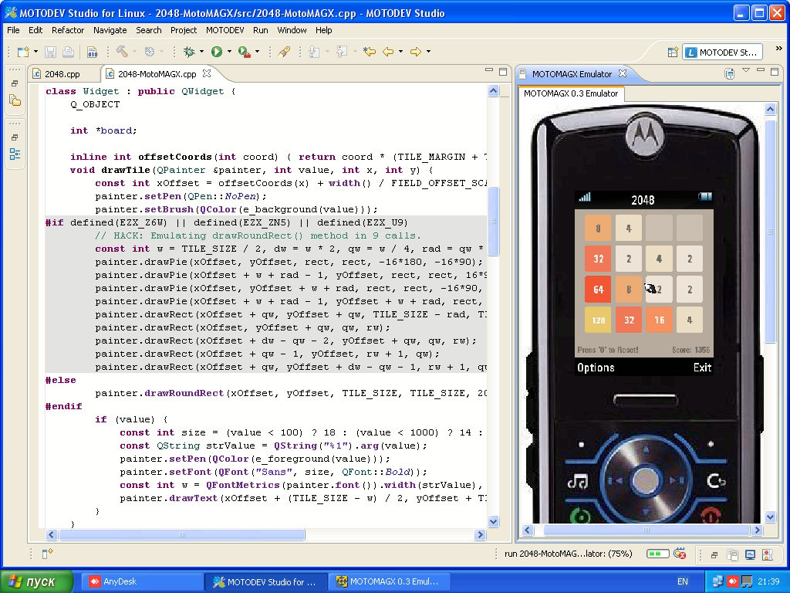

2048-MotoMAGX
=============

   

## Toolchain & SDK

Download MotoMAGX Toolchain & SDK from [this page](https://exlmoto.ru/toolchains-sdk-for-motomagx/) on my blog.

## Install Tools & Build

CentOS 7 Recipe:

```sh
sudo yum -y install epel-release

sudo yum -y install @development
sudo yum -y install glibc.i686 libstdc++.i686
sudo yum -y install p7zip

sudo mkdir /opt/toolchains/
sudo tar -C /opt/toolchains/ -xzvf ~/Downloads/motomagx-toolchains*.tar.gz*
sudo ln -s -d /opt/toolchains/motomagx/arm-eabi/ -t /
sudo cp /opt/toolchains/motomagx/arm-eabi/lib/ezx-zn5/include/morphing_mode.h /opt/toolchains/motomagx/arm-eabi/lib/ezx-u9/include/
sudo ln -sf /opt/toolchains/motomagx/arm-eabi/lib/ezx-zn5/lib/liblighting.so.1.0.0 /opt/toolchains/motomagx/arm-eabi/lib/ezx-u9/lib/liblighting.so

cd ~/Projects/
git clone https://github.com/EXL/2048
cd 2048/2048-MotoMAGX/
./build.sh
```

## Create MGX Package for Motorola ZN5

```sh
cd ~/Projects/2048/2048-MotoMAGX/
mkdir /tmp/2048/
cp 2048-MotoMAGX_ZN5 /tmp/2048/
cp mgx/2048.cfg /tmp/2048/
cp ../image/icon/ic_launcher0.png /tmp/2048/icon_usr.png
7za a -t7z -m0=lzma -mx=9 -mfb=64 -md=32m -ms=on 2048.7z /tmp/2048/
mv 2048.7z 2048_MotoMAGX_ZN5_v1.0_28-Jul-2020.mgx
```

## MotoMAGX Development Environment

MOTODEV Studio for Linux:


