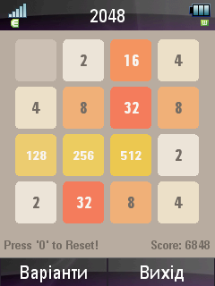
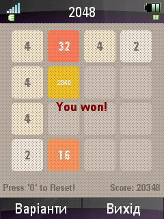
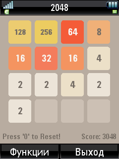
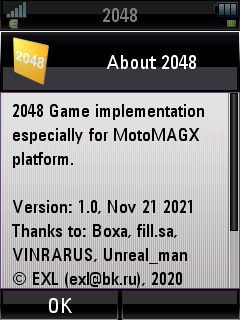

2048-MotoMAGX
=============

   

 

The "2048" game for the [MotoMAGX OS](https://en.wikipedia.org/wiki/MotoMagx) by Motorola.

## Toolchain & SDK

Download MotoMAGX Toolchain & SDK from [this page](https://exlmoto.ru/toolchains-sdk-for-motomagx/) on my blog.

## Install Tools & Build

CentOS 7 Recipe:

```sh
sudo yum -y install epel-release

sudo yum -y install @development
sudo yum -y install glibc.i686 libstdc++.i686
sudo yum -y install p7zip

sudo mkdir /opt/toolchains/
sudo tar -C /opt/toolchains/ -xzvf ~/Downloads/motomagx-toolchains*.tar.gz*
sudo ln -s -d /opt/toolchains/motomagx/arm-eabi/ -t /
sudo cp /opt/toolchains/motomagx/arm-eabi/lib/ezx-zn5/include/morphing_mode.h /opt/toolchains/motomagx/arm-eabi/lib/ezx-u9/include/
sudo ln -sf /opt/toolchains/motomagx/arm-eabi/lib/ezx-zn5/lib/liblighting.so.1.0.0 /opt/toolchains/motomagx/arm-eabi/lib/ezx-u9/lib/liblighting.so

cd ~/Projects/
git clone https://github.com/EXL/2048
cd 2048/2048-MotoMAGX/
./build.sh
```

## Create MGX Package for Motorola ZN5

```sh
cd ~/Projects/2048/2048-MotoMAGX/
mkdir /tmp/2048/
cp 2048-MotoMAGX_ZN5 /tmp/2048/
cp mgx/2048.cfg /tmp/2048/
cp ../image/icon/ic_launcher0.png /tmp/2048/icon_usr.png
7za a -t7z -m0=lzma -mx=9 -mfb=64 -md=32m -ms=on 2048.7z /tmp/2048/
mv 2048.7z 2048_MotoMAGX_ZN5_v1.0_28-Jul-2020.mgx
```

## MotoMAGX Development Environment

MOTODEV Studio for Linux:


## Versions

Qt Embedded version 2.3.6/2.3.8

### Linux host:

* Any Linux distro with support for running 32-bit x86 applications and tools.

```sh
arm-linux-gnueabi-gcc --version | head -1
arm-linux-gnueabi-gcc (GCC) 3.4.3 (MontaVista 3.4.3-25.0.96.%{_mvl_build_id} 2007-11-17)

arm-linux-gnueabi-g++ --version | head -1
arm-linux-gnueabi-g++ (GCC) 3.4.3 (MontaVista 3.4.3-25.0.96.%{_mvl_build_id} 2007-11-17)
```

### Windows host for MOTODEV Studio for Linux:

* Windows XP SP2 or SP3 (tested) 32-bit x86
* SUN Java JRE 1.5.0, *jre-1_5_0_12-windows-i586-p.exe*
* VMWare Player 2.0.4, *VMware-Player-2-0-4.exe*
* MOTODEV Studio for Linux 0.3.0, *MOTODEV_Studio_for_Linux_0.3.0_Windows.exe*

Download these installers on the [Yandex.Disk](https://yadi.sk/d/qg7HCi5h_LTeuw) file sharing service.

```bat
i686-mot-linux-gnu-gcc.exe --version
i686-mot-linux-gnu-gcc (GCC) 3.4.3 (MontaVista 3.4.3-25.0.96.custom 2008-01-17)

i686-mot-linux-gnu-g++.exe --version
i686-mot-linux-gnu-g++ (GCC) 3.4.3 (MontaVista 3.4.3-25.0.96.custom 2008-01-17)
```

## Information

Additional information about porting in [NotesMotoMAGX.md](../doc/NotesMotoMAGX.md) document file.

Thanks for screenshots and testing: Boxa, fill.sa, VINRARUS, Unreal_man.
