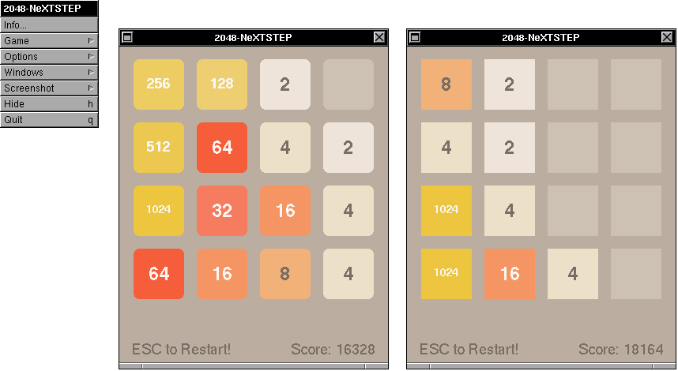
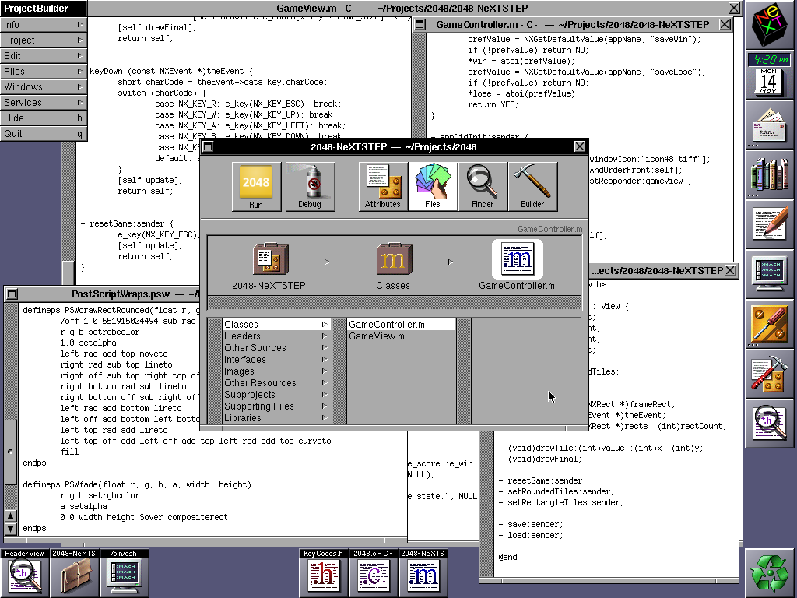
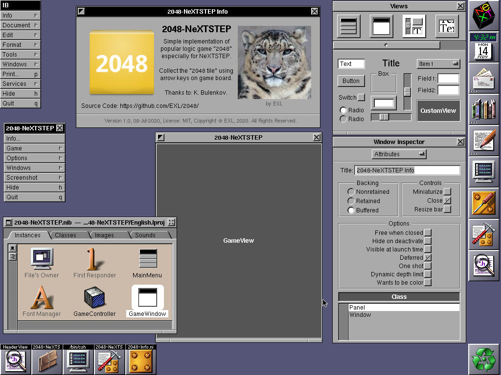

2048-NeXTSTEP
=============



## Developer Tools

Install Developer Tools Packages from **NeXTSTEP_3.3_Developer.iso** CD:

1. NextCD/Packages/DeveloperTools.pkg
2. NextCD/Packages/DeveloperLibs.pkg
3. NextCD/Packages/DeveloperDoc.pkg
4. NextCD/Packages/GNUSource.pkg (optional)

## Create MS-DOS Floppy Disk Image with Source Code

Host CentOS 7 Packing Recipe:

```sh
sudo yum -y install @development

cd ~/Projects/
git clone https://github.com/EXL/2048
cd 2048/
tar -cvf 2048.tar 2048-NeXTSTEP/ src/ image/icon/icon48.tiff image/icon/icon150.tiff image/avatar.tiff

mkfs.msdos -C floppy.img 1440 -n "SRC"
sudo mount floppy.img /mnt/
sudo mv 2048.tar /mnt/ # Skip "mv: failed to preserve ownership for '/mnt/2048.tar': Operation not permitted" error.
sudo umount /mnt/
```

Now insert **floppy.img** to your emulator or virtual machine floppy drive.

## Transfer Source Code to the NeXTSTEP

Guest NeXTSTEP Unpacking Recipe:

Choose **Workspace => Disk => Check for Disks** and open Terminal application from **NextApps/Terminal.app**:

```csh
mkdirs ~/Projects/2048/
cd ~/Projects/2048/
cp /src/2048.tar .
tar -xvf 2048.tar
find . -type f -exec touch {} \; # Recursive reset files to system date.
rm 2048.tar
```

## Building via Project Builder

1. Go to the **~/Projects/2048/2048-NeXTSTEP/** directory and double click on **PB.project** file.
2. Click on the **Builder** button in the Project Builder application.
3. Choose **Target: install** and click on the **Build** orange button.

## Building via Makefile

```csh
cd ~/Projects/2048/2048-NeXTSTEP/
make TARGET_ARCHS="m68k i386 hppa sparc" install
```

## Run

Go to the **~/Apps/** directory and double click on the **2048-NeXTSTEP.app** application.

## Create Package

Build application for all 4 CPU architectures first and install it to the **~/Apps/** directory (see previous items).

```csh
mkdirs ~/Root/
mv ~/Apps/2048-NeXTSTEP.app ~/Root/
/NextAdmin/Installer.app/package ~/Root/ ~/Projects/2048/2048-NeXTSTEP/2048-NeXTSTEP.info ~/Projects/2048/image/icon/icon48.tiff -d .
mv 2048-NeXTSTEP.pkg ~/Root/
```

Get **2048-NeXTSTEP.pkg** package in the **~/Root/** directory.

## Write Application and Package to the Floppy Disk Image

Build application and create package for all 4 CPU architectures first and move entities to the **~/Root/** directory (see previous items).

```csh
cd ~/Root/
tar -cvf pack.tar 2048-NeXTSTEP.app 2048-NeXTSTEP.pkg
mv pack.tar /src/
```

Choose **Workspace => Disk => Eject** menu item.

## NeXTSTEP Development Environment

Project Builder:



Interface Builder:


