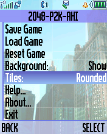

2048-P2K-AHI
============

A popular "2048" puzzle game for Motorola P2K implemented as ELF-application. Written using AFW/UIS frameworks and AHI (ATI Handheld Interface) video driver.

*Motorola SLVR L6 Screenshots:*

    

*Motorola V600 Screenshots:*

    

*Motorola ROKR E1 Screenshots:*

    

## ELF files

* 2048-P2K-AHI_EP1.elf (ELF for ElfPack 1.0)
* 2048-P2K-AHI_EP1_V600.elf (ELF for ElfPack 1.0, Motorola V600 version)
* 2048-P2K-AHI_EP2.elf (ELF for ElfPack 2.0)

The ELF-application has been tested on the following phones and firmware:

* Motorola SLVR L6: R3443H1_G_0A.65.0BR
* Motorola ROKR E1: R373_G_0E.30.49R
* Motorola V600: TRIPLETS_G_0B.09.72R

Application type: GUI + UIS Canvas + ATI.

This version uses hardware accelerated rendering of the game field using the AHI (ATI Handheld Interface) video driver of ATI Imageon W22xx GPUs. All additional information about the building and P2K ELFs can be found in the [2048-P2K-UIS](../../2048-P2K) project and documents.
