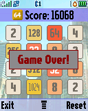
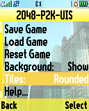
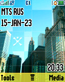

2048-P2K-UIS
============

The "2048" puzzle game for the Motorola P2K platform written using AFW and UIS frameworks and implemented as ELF-application.

*Motorola SLVR L6 Screenshots:*

    

    

    

*Motorola ROKR E1 Screenshots:*

    

    

    

TODO: Build recipes, etc. About ElfPacks and it's compiler versions.

## Additional Stuff

The P2K OS screenshots from Motorola SLVR L6:

    

    

    

The P2K OS screenshots from Motorola ROKR E1:

    

    

    

TODO: Move this to notes!

Icon sizes is 41x41 (GIF big, animated), 33x33 (GIF big, static), 15x15 (GIF small, static)
