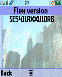
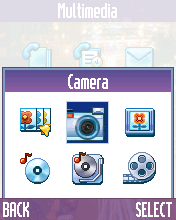
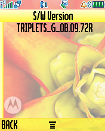
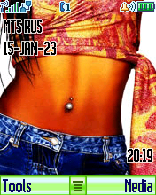
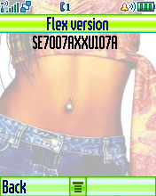

2048-P2K-UIS
============

The "2048" puzzle game for the Motorola P2K platform written using AFW and UIS frameworks and implemented as ELF-application.

*Motorola SLVR L6 Screenshots:*

    

    

    

*Motorola V600 Screenshots:*

    

    

    

*Motorola ROKR E1 Screenshots:*

    

    

    

This game uses native APIs and frameworks, the ones that the phone's firmware uses itself! All applications for the Motorola P2K OS are built on top of the AFW (Application Framework) which implements event-driven programming and non-preemptive multitasking, the [Event-driven finite-state](https://en.wikipedia.org/wiki/Event-driven_finite-state_machine) machine pattern is very actively used which bloats the application's codebase a lot. The AFW approach is reminiscent of modern Android development with Activities in some ways.

The UI of both the game itself and the firmware of P2K OS based phones uses the UIS (User Interaction Services) framework for windows, menus, and dialogs. Therefore, changing the skin changes the appearance of the application. A subset of the UIS Canvas is used to render arbitrary and complex graphic elements. e.g. the stock MotoMixer (GrooveTunes) application was implemented similar to my port of the 2048 game. An interesting fact: the Canvas API has a function for drawing a rectangle with rounded corners, which greatly slows down the rendering speed.

Native user applications launching support is implemented using a special firmware patch called ElfPack (ElfLoader) which realize the ability to launch executable files in the popular [ELF format](https://en.wikipedia.org/wiki/Executable_and_Linkable_Format) and adds support for libraries with function calls and other entities like constants and events from the firmware. Support of custom ELF applications were implemented not only for Motorola, but also for Siemens and Sony Ericsson phones. There was also some work by enthusiasts to add ELF support to LG phones such as the KP500. The ability to run ELF applications on Motorola phones was implemented by developers from the MotoFan.Ru forum: Andy51, Vilko, tim_apple, G-XaD, om2804, kadukmm, baat, z3DD3r, Chik_v, fkoder, DmT, motoprogger, etc.

At the moment, the 2048 game has been tested on Motorola ROKR E1 (E398) and Motorola SLVR L6 phones whose CPU core uses the ARM architecture. In addition, there is an untested build for [M·CORE](https://en.wikipedia.org/wiki/M%C2%B7CORE) architecture which is used by Motorola RAZR V3x and Motorola E770v phones. At the time, this rare and unique CPU architecture rivaled ARM and was superior in many ways.

## Toolchain & SDK

* ElfPack v1.x Windows ELFKIT download link. // TODO:
* ElfPack v1.x Linux ELFKIT download link. // TODO:
* ElfPack v2.x Windows ELFKIT download link. // TODO:
* ElfPack v1.x M*CORE Windows ELFKIT download link. // TODO:
* ElfPack v2.x M*CORE Windows ELFKIT download link. // TODO:

## Install Tools & Build & Run

Windows recipe:

```bat
> cd 2048\2048-P2K\
> make_ep1.bat clean
> make_ep1.bat
> make_ep2.bat clean
> make_ep2.bat
> make_em1.bat clean
> make_em1.bat
> make_em2.bat clean
> make_em2.bat
```

Linux recipe (ElfPack 1.x build only):

```bash
$ cd 2048/2048-P2K/
$ make clean
$ make
```

The ELF-application has been tested on the following phones and firmware:

* Motorola SLVR L6: R3443H1_G_0A.65.0BR
* Motorola ROKR E1: R373_G_0E.30.49R
* Motorola V600: TRIPLETS_G_0B.09.72R
* Motorola V360: R4513_G_08.B7.ACR
* Motorola V235: R3512_G_0A.30.6CR
* Motorola SLVR L7: R4513_G_08.B7.E0R_RB
* Motorola RAZR V3i: R4441D_G_08.01.03R
* Motorola RAZR V3r: R4515_G_08.BD.D3R

Application type: GUI.

## Additional Stuff

The P2K OS screenshots from Motorola SLVR L6:

    

    

    

The P2K OS screenshots from Motorola V600:

    

    

    

The P2K OS screenshots from Motorola ROKR E1:

    

    

    

Photos of 2048 game running on Motorola SLVR L6 and Motorola ROKR E1:


Photos of 2048 game running on Motorola V235, thanks @Indepth6:


Photos of 2048 game running on Motorola RAZR V3r, thanks @Blue_Screen_0f_Death:

 

## Versions

ElfPack v1.x Tools:

```bat
> tcc
Thumb C Compiler, ADS1.2 [Build 848]
> armcc
ARM C Compiler, ADS1.2 [Build 848]
> tcpp
Thumb C++ Compiler, ADS1.2 [Build 848]
> armcpp
ARM C++ Compiler, ADS1.2 [Build 848]
> armlink
ARM Linker, ADS1.2 [Build 848]
```

ElfPack v2.x Tools:

```bat
> arm-eabi-gcc -v
Target: arm-eabi
Configured with: ../../gcc-4.4.0/configure --enable-languages=c,c++,objc --with-cpu=arm7tdmi --enable-interwork --enable-multilib --with-gcc --with-gnu-ld --with-gnu-as --disable-shared --disable-threads --disable-win32-registry --disable-nls --disable-debug --disable-libmudflap --disable-libssp --disable-libgomp --disable-libstdcxx-pch --target=arm-eabi --with-newlib --prefix=c:/devkitPro/devkitARM --with-bugurl=http://wiki.devkitpro.org/index.php/Bug_Reports --with-pkgversion='devkitARM release 26'
Thread model: single
gcc version 4.4.0 (devkitARM release 26)
> arm-eabi-g++ -v
Target: arm-eabi
Configured with: ../../gcc-4.4.0/configure --enable-languages=c,c++,objc --with-cpu=arm7tdmi --enable-interwork --enable-multilib --with-gcc --with-gnu-ld --with-gnu-as --disable-shared --disable-threads --disable-win32-registry --disable-nls --disable-debug --disable-libmudflap --disable-libssp --disable-libgomp --disable-libstdcxx-pch --target=arm-eabi --with-newlib --prefix=c:/devkitPro/devkitARM --with-bugurl=http://wiki.devkitpro.org/index.php/Bug_Reports --with-pkgversion='devkitARM release 26'
Thread model: single
gcc version 4.4.0 (devkitARM release 26)
> arm-eabi-ld -V
GNU ld (GNU Binutils) 2.19.1
  Supported emulations:
   armelf
```

ElfPack M*CORE Tools:

```bat
> mcore-elf-gcc -v
Configured with: /usr/local/src/gnu/gcc-3.4.6/configure --target=mcore-elf --host=i686-pc-cygwin --build=i686-pc-cygwin
Thread model: single
gcc version 3.4.6
> mcore-elf-g++ -v
Configured with: /usr/local/src/gnu/gcc-3.4.6/configure --target=mcore-elf --host=i686-pc-cygwin --build=i686-pc-cygwin
Thread model: single
gcc version 3.4.6
> mcore-elf-ld -V
GNU ld (GNU Binutils) 2.18.50.20080711
  Supported emulations:
   elf32mcore
```

## Information

* [NotesMotoP2K.md](../doc/NotesMotoP2K.md): Document contains additional information about ElfPacks on Motorola P2K phones.
* [ELFs development and porting](https://forum.motofan.ru/index.php?showforum=184): A section of the MotoFan.Ru forum dedicated to the development and porting of ELFs.
* [ElfPack 1.x](https://wiki.motofan.ru/ElfPack): Page on MotoWiki site about first version of ElfPack for Motorola P2K phones.
* [ElfPack 2.x](https://wiki.motofan.ru/ElfPack2): Page on MotoWiki site about second version of ElfPack for Motorola P2K phones.
* [ElfPack 1.x M*CORE](https://forum.motofan.ru/index.php?showtopic=176195): A thread on the MotoFan.Ru forum dedicated to the development and porting of ELFs to M*CORE architecture and Rainbow POG platform (first version).
* [ElfPack 2.x M*CORE](https://forum.motofan.ru/index.php?showtopic=149775): A thread on the MotoFan.Ru forum dedicated to the development and porting of ELFs to M*CORE architecture and Rainbow POG platform (second version).
