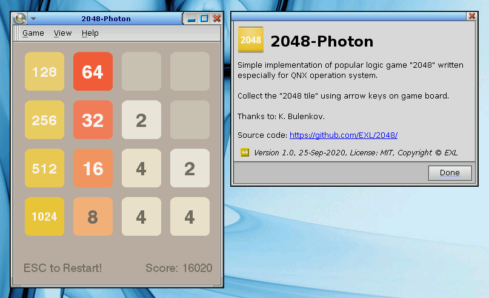
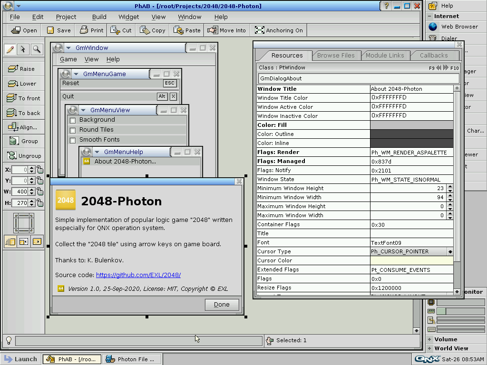

2048-Photon
===========



## QNX OS & Developer Tools

Download [QNX® Software Development Platform 6.5.0 for x86](http://myqnx.com/download/feature.html?programid=23647) ISO image file, install it to Oracle VM VirtualBox or VMWare Workstation Player.

Filename: *qnxsdp-6.5.0-x86-201007091524-nto.iso*

This image contains the required compilers and the PhAB application.

## Build & Run via PhAB

1. Click "Launch" menu, choose "QNX Software Development Platform 6.5.0" and run "Photon Application Builder".
2. Go to "File" menu, choose "Open" and select "2048-Photon" project in PhAB.
3. Go to "Build" menu, choose "Rebuild All" item.
4. Go to "Build" menu, choose "Build & Run" item then push "OK" button.

## Build & Run via Makefile

```sh
cd ~/Projects/2048/2048-Photon
make all
strip -s x86/o/2048-Photon
./x86/o/2048-Photon
```

## QNX Development Environment

QNX Photon Application Builder or PhAB:




Text Editor and Terminal applications for editing and building source code:


