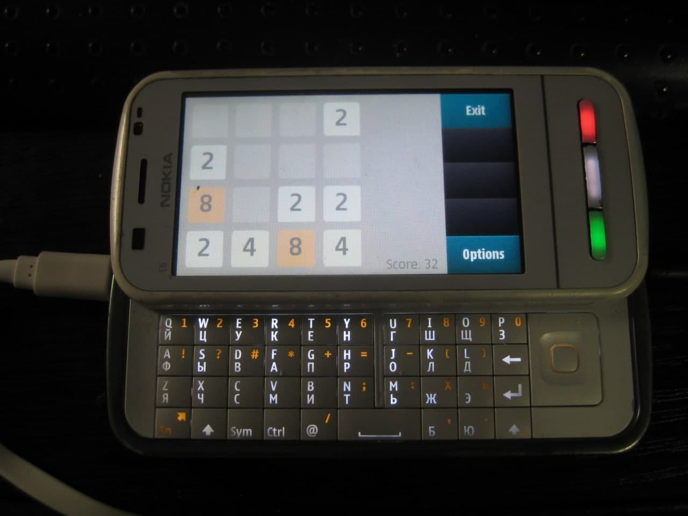

2048-Qt4-S60
============



## Build & Run

You need [Qt SDK for Symbian 1.1.2 & Symbian S60 SDK](https://mrrosset.github.io/Symbian-Archive/SDKs-Langs.html) to build this program. Building tested with "[Qt_SDK_Win_offline_v1_1_2_en.exe](http://cyber.sibsutis.ru/Merzlyakova/%D0%A7%D0%9C%D0%92/%D0%94%D0%B8%D1%81%D1%82%D1%80%D0%B8%D0%B1%D1%83%D1%82%D0%B8%D0%B2%20Qt%20Creator/Qt_SDK_Win_offline_v1_1_2_en.exe)" installer on Windows 7 and Windows 10.

1. Open "2048-Qt4-S60.pro" project file with Qt Creator IDE which comes with the Nokia Qt SDK.
2. Check "Symbian Device" and "Qt Simulator" setup targets and click "Finish" button.
3. Select "Symbian Device" => "Build" => "Qt 4.7.1 for Symbian^1 (Qt SDK) Release" in target menu (above big green "Run" button).
4. Click "Build" => "Rebuild All" item in the main menu.
5. Click "Build" => 'Deploy Project "2048-Qt4-S60"' item in the main menu.
6. Get "2048-Qt4-S60.sis" package.

## Versions

* Qt SDK 1.1.2
* Qt Creator 2.2.1
* Qt 4.7.3

```
arm-none-symbianelf-gcc.exe -v
Using built-in specs.
Target: arm-none-symbianelf
Configured with: /scratch/nathan/symbian-arm/src/gcc-4.4/configure --build=i686-pc-linux-gnu --host=i686-mingw32 --target=arm-none-symbianelf --enable-threads --disable-libmudflap --disable-libssp --disable-libstdcxx-pch --enable-extra-sgxxlite-multilibs --with-gnu-as --with-gnu-ld --with-specs='%{O2:%{!fno-remove-local-statics: -fremove-local-statics}} %{O*:%{O|O0|O1|O2|Os:;:%{!fno-remove-local-statics: -fremove-local-statics}}}' --enable-languages=c,c++ --enable-shared --disable-lto --with-pkgversion='Symbian ADT Sourcery G++ Lite 4.4-172' --with-bugurl=https://support.codesourcery.com/GNUToolchain/ --disable-nls --prefix=/opt/codesourcery --with-libiconv-prefix=/scratch/nathan/symbian-arm/obj/host-libs-4.4-172-arm-none-symbianelf-i686-mingw32/usr --with-gmp=/scratch/nathan/symbian-arm/obj/host-libs-4.4-172-arm-none-symbianelf-i686-mingw32/usr --with-mpfr=/scratch/nathan/symbian-arm/obj/host-libs-4.4-172-arm-none-symbianelf-i686-mingw32/usr --with-ppl=/scratch/nathan/symbian-arm/obj/host-libs-4.4-172-arm-none-symbianelf-i686-mingw32/usr --with-host-libstdcxx='-static-libgcc -Wl,-Bstatic,-lstdc++,-Bdynamic -lm' --with-cloog=/scratch/nathan/symbian-arm/obj/host-libs-4.4-172-arm-none-symbianelf-i686-mingw32/usr --disable-libgomp --enable-poison-system-directories --with-build-time-tools=/scratch/nathan/symbian-arm/obj/tools-i686-pc-linux-gnu-4.4-172-arm-none-symbianelf-i686-mingw32/arm-none-symbianelf/bin --with-build-time-tools=/scratch/nathan/symbian-arm/obj/tools-i686-pc-linux-gnu-4.4-172-arm-none-symbianelf-i686-mingw32/arm-none-symbianelf/bin
Thread model: single
gcc version 4.4.1 (Symbian ADT Sourcery G++ Lite 4.4-172)

arm-none-symbianelf-g++.exe -v
Using built-in specs.
Target: arm-none-symbianelf
Configured with: /scratch/nathan/symbian-arm/src/gcc-4.4/configure --build=i686-pc-linux-gnu --host=i686-mingw32 --target=arm-none-symbianelf --enable-threads --disable-libmudflap --disable-libssp --disable-libstdcxx-pch --enable-extra-sgxxlite-multilibs --with-gnu-as --with-gnu-ld --with-specs='%{O2:%{!fno-remove-local-statics: -fremove-local-statics}} %{O*:%{O|O0|O1|O2|Os:;:%{!fno-remove-local-statics: -fremove-local-statics}}}' --enable-languages=c,c++ --enable-shared --disable-lto --with-pkgversion='Symbian ADT Sourcery G++ Lite 4.4-172' --with-bugurl=https://support.codesourcery.com/GNUToolchain/ --disable-nls --prefix=/opt/codesourcery --with-libiconv-prefix=/scratch/nathan/symbian-arm/obj/host-libs-4.4-172-arm-none-symbianelf-i686-mingw32/usr --with-gmp=/scratch/nathan/symbian-arm/obj/host-libs-4.4-172-arm-none-symbianelf-i686-mingw32/usr --with-mpfr=/scratch/nathan/symbian-arm/obj/host-libs-4.4-172-arm-none-symbianelf-i686-mingw32/usr --with-ppl=/scratch/nathan/symbian-arm/obj/host-libs-4.4-172-arm-none-symbianelf-i686-mingw32/usr --with-host-libstdcxx='-static-libgcc -Wl,-Bstatic,-lstdc++,-Bdynamic -lm' --with-cloog=/scratch/nathan/symbian-arm/obj/host-libs-4.4-172-arm-none-symbianelf-i686-mingw32/usr --disable-libgomp --enable-poison-system-directories --with-build-time-tools=/scratch/nathan/symbian-arm/obj/tools-i686-pc-linux-gnu-4.4-172-arm-none-symbianelf-i686-mingw32/arm-none-symbianelf/bin --with-build-time-tools=/scratch/nathan/symbian-arm/obj/tools-i686-pc-linux-gnu-4.4-172-arm-none-symbianelf-i686-mingw32/arm-none-symbianelf/bin
Thread model: single
gcc version 4.4.1 (Symbian ADT Sourcery G++ Lite 4.4-172)
```

*© [Limows](https://github.com/Limows)*
