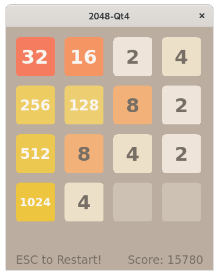

2048-Qt4
========



## Build & Run

CentOS 7 Recipe:

```sh
sudo yum -y install epel-release

sudo yum -y install @development
sudo yum -y install cmake3
sudo yum -y install qt4-devel

cd ~/Projects/
git clone https://github.com/EXL/2048
cd 2048/2048-Qt4/
cmake3 -DCMAKE_BUILD_TYPE=Release .
make VERBOSE=1
strip -s 2048-Qt4

./2048-Qt4
```
