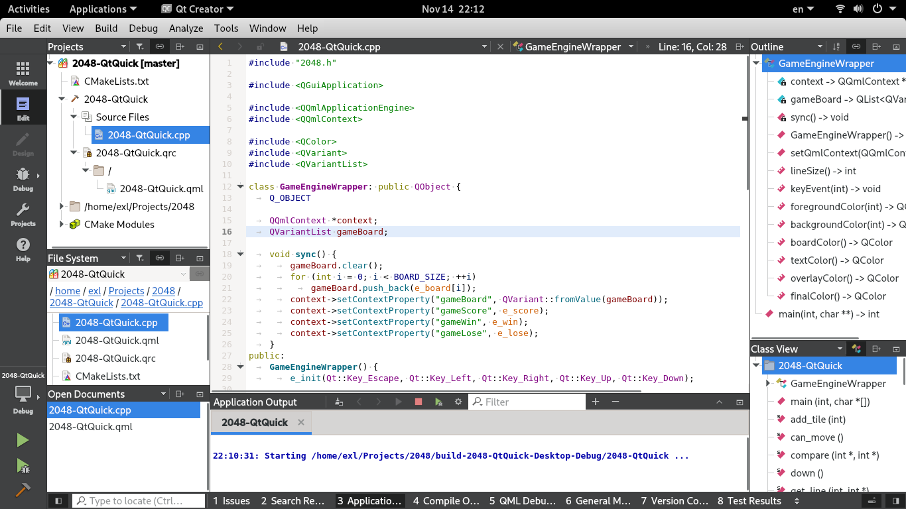

2048-QtQuick
============


## Build & Run

CentOS 7 Recipe:

```sh
sudo yum -y install epel-release

sudo yum -y install @development
sudo yum -y install cmake3
sudo yum -y install qt5-qtbase-devel # Fedora package: qt5-devel

cd ~/Projects/
git clone https://github.com/EXL/2048
cd 2048/2048-QtQuick/
cmake3 -DCMAKE_BUILD_TYPE=Release .
make VERBOSE=1
strip -s 2048-QtQuick

./2048-QtQuick
```

## Qt Development Environment

Qt Creator 4.13.2:


