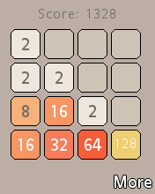
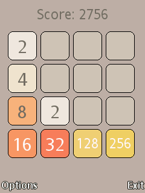
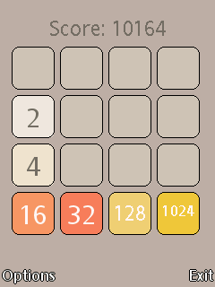
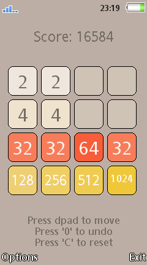

2048-SE
========

2048 for Sony Ericsson A1 and A2 running [ElfPack v1.999](https://github.com/farid1991/elfpack-se). Ported by [farid1991](https://github.com/farid1991).

## Build & Run

1. Clone the [elfpack-se](https://github.com/farid1991/elfpack-se) repository to your computer.
2. Copy the `C++\` and `include\` folder from the `elfpack-se` into the 2048-SE folder. 
3. Open project file `2048.eww` with IAR 4.2.
4. Compile the project
5. Send compiled ELF file to a SE phone and open it from the file manager. 