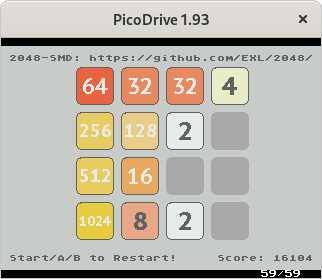
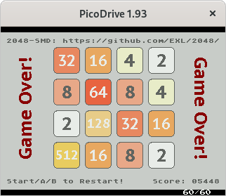
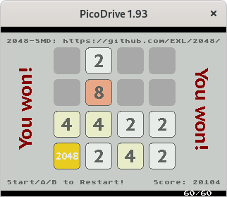
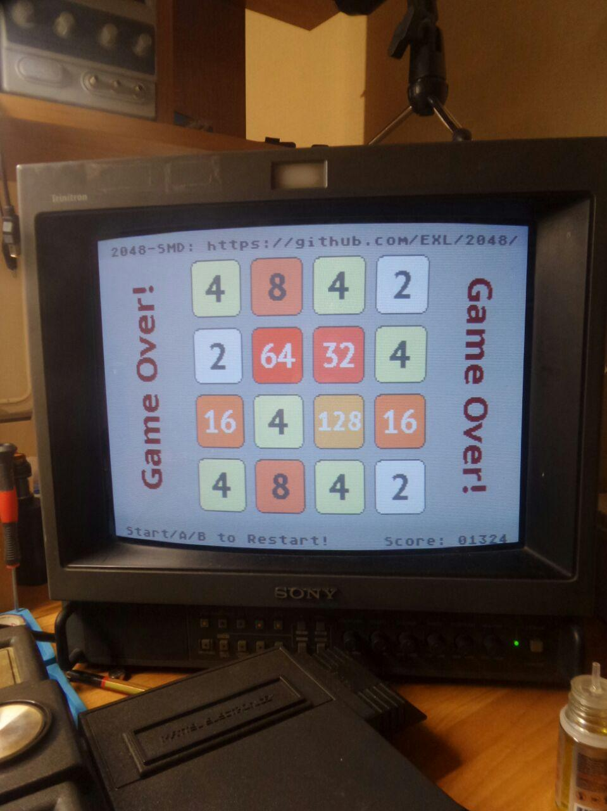

2048-SMD
========

  

Port 2048 game to the [Sega Mega Drive/Sega Genesis](https://en.wikipedia.org/wiki/Sega_Genesis) consoles with using [SGDK](https://github.com/Stephane-D/SGDK) development kit.

## Install SGDK v1.60

Fedora 33 Recipe:

```sh
sudo dnf install -y p7zip wine git

mkdir -p ~/Projects/SEGA/SGDK/
cd ~/Projects/SEGA/SGDK/
curl -LOJ https://github.com/Stephane-D/SGDK/releases/download/v1.60/sgdk160.7z
7za x sgdk160.7z
rm sgdk160.7z

cd ~/Projects/SEGA/SGDK/bin/
# https://github.com/Franticware/SGDK_wine
curl -LOJ https://raw.githubusercontent.com/Franticware/SGDK_wine/34e8a39077efb766e51e3c3739495f08ce21d40f/generate_wine.sh
bash generate_wine.sh
```

## Build ROM

```sh
export GDK=/home/exl/Projects/SEGA/SGDK

cd ~/Projects/
git clone https://github.com/EXL/2048
cd 2048/2048-SMD/

# make -f $GDK/makefile.gen
make -f $GDK/makefile_wine.gen

mv out/rom.bin 2048-SMD.bin
```

## Run ROM

You can run "2048-SMD.bin" ROM on any Sega Mega Drive/Sega Genesis emulator or real console.



*The 2048-SMD game launched on the real Sega Mega Dirve console, author of photo: Roma Setov (@tl072).*
