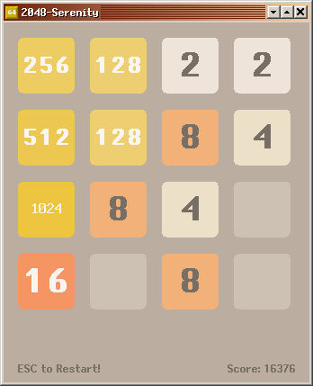
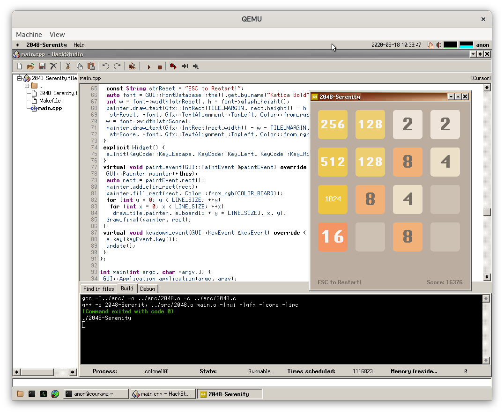

2048-Serenity
=============



The "2048" game for the [Serenity OS](https://github.com/SerenityOS/serenity) by Andreas Kling.

See [SerenityOS build instructions](https://github.com/SerenityOS/serenity/blob/master/Documentation/BuildInstructions.md) for information about building Serenity OS before compiling this game.

## Build & Run via Ports

```sh
cd ~/Projects/
git clone https://github.com/EXL/2048
cp -aR ~/Projects/2048/2048-Serenity/port/2048/ ~/Projects/serenity/Ports/
cd ~/Projects/serenity/Ports/2048/
./package.sh

cd ~/Projects/serenity/Build/
make image
make run
```

Run game via "Main Menu" => "Games" => "2048-Serenity" menu item.

## Build & Run via HackStudio

```sh
cd ~/Projects/
git clone https://github.com/EXL/2048
cp -aR ~/Projects/2048 ~/Projects/serenity/Base/home/anon/

cd ~/Projects/serenity/Build/
make image
make run
```

Run HackStudio, open `2048-Serenity.files` project, build and run game.

## Build & Run via Makefile

Host:

```sh
cd ~/Projects/
git clone https://github.com/EXL/2048
cp -aR ~/Projects/2048 ~/Projects/serenity/Base/home/anon/

cd ~/Projects/serenity/Build/
make image
make run
```

Guest:

```sh
cd ~/2048/2048-Serenity/
make

./2048-Serenity
```

## Serenity OS Development Environment

HackStudio for Serenity OS:



## Versions

* SerenityOS 1.0.gb245121
* Host Toolchain Compiler

    ```
    gcc --version
    gcc (GCC) 10.1.0

    g++ --version
    g++ (GCC) 10.1.0
    ```

* Guest Toolchain Compiler

    ```
    i686-pc-serenity-gcc --version
    i686-pc-serenity-gcc (GCC) 10.1.0

    i686-pc-serenity-g++ --version
    i686-pc-serenity-g++ (GCC) 10.1.0
    ```
