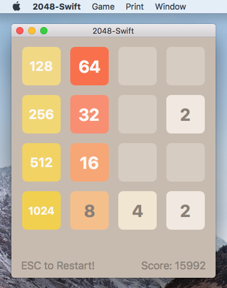
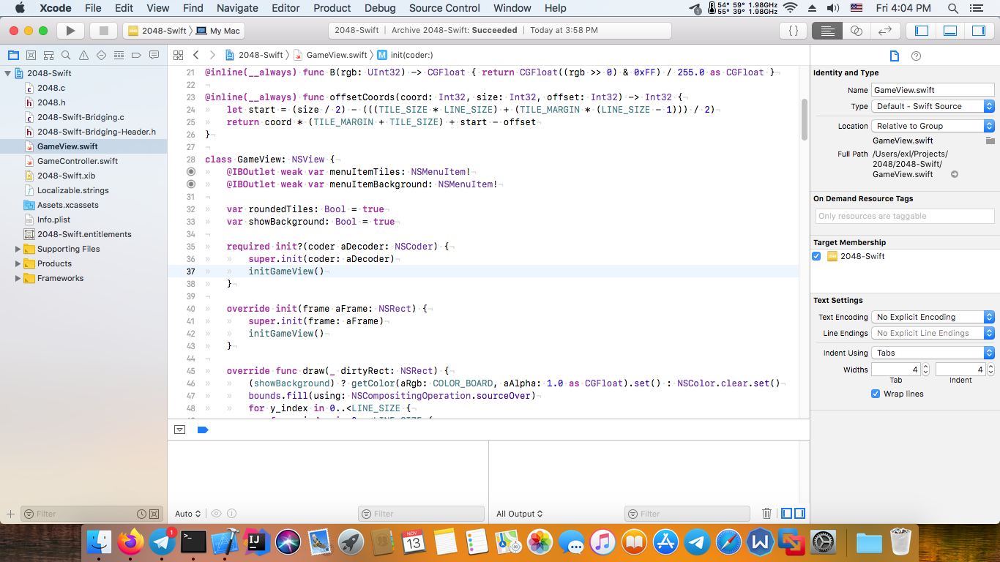
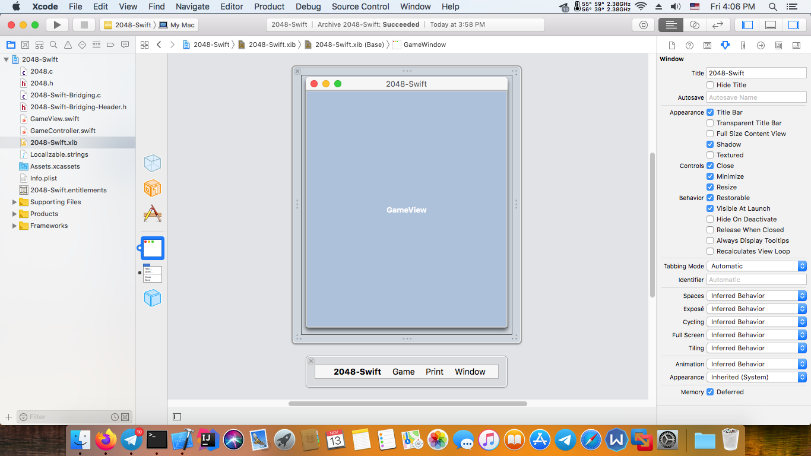

2048-Swift
==========



## Building application via Xcode 10

1. Open **2048-Swift.xcodeproj** project.
2. Choose **Product** => **Clean Build Folder** in the global menu then choose **Product** => **Archive** item.
3. Select in the window that opens **Distribute App** button.
4. Choose **Copy App** option then set directory and click export.
5. Get **2048-Swift.app** package from selected directory.

## Building application via Command-Line tools

```bash
git clone https://github.com/EXL/2048
cd 2048/2048-Swift/

xcodebuild -scheme 2048-Swift clean archive -archivePath 2048-Swift
xcodebuild -exportArchive -archivePath 2048-Swift.xcarchive -exportPath build -exportOptionsPlist 2048-Swift.xcarchive/Info.plist
```

## Building application via Travis-CI

Travis-CI recipe:

```yml
os: osx
osx_image: xcode10.1
language: objective-c
script:
    - cd 2048-Swift/
    - xcodebuild -scheme 2048-Swift archive -archivePath 2048-Swift CODE_SIGN_IDENTITY="" CODE_SIGNING_REQUIRED=NO
    - tar -cvzf 2048-Swift.gz 2048-Swift.xcarchive
    - curl --upload-file ./2048-Swift.gz https://free.keep.sh
```

## macOS Development Environment

Xcode 10:





## Versions

* macOS 10.13.6 (Build 17G14033)
* Xcode 10.1 (Build 10B61)
* Swift 4.2.1

Compiler on macOS 10.13.6 and x86_64 platform:

```
cc -v
Apple LLVM version 10.0.0 (clang-1000.11.45.5)
Target: x86_64-apple-darwin17.7.0
Thread model: posix
InstalledDir: /Applications/Xcode.app/Contents/Developer/Toolchains/XcodeDefault.xctoolchain/usr/bin

swiftc -v
Apple Swift version 4.2.1 (swiftlang-1000.11.42 clang-1000.11.45.1)
Target: x86_64-apple-darwin17.7.0
```
