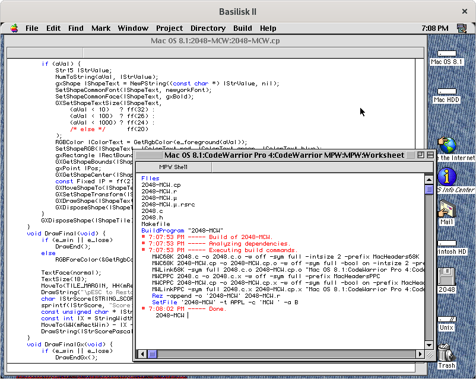

2048-MCW
========

| Render       | Mac OS System 7.5.3 | Mac OS 8.1 | Mac OS 9.0 |
|--------------|---------------------|------------|------------|
| QuickDraw    |  |  |  |
| QuickDraw GX |  |  |  |

The "2048" game for the [classic Mac OS](https://en.wikipedia.org/wiki/Classic_Mac_OS) platform (System 7-9) with using [Macintosh Toolbox](https://en.wikipedia.org/wiki/Macintosh_Toolbox), [QuickDraw](https://en.wikipedia.org/wiki/QuickDraw), and [QuickDraw GX](https://en.wikipedia.org/wiki/QuickDraw_GX) technologies. It's also works on the Mac OS System 6 with Color QuickDraw and [Macintosh II](https://en.wikipedia.org/wiki/Macintosh_II) ROM but there is a crash in the "About 2048-MCW..." dialog.

## Setup Basilisk II Environment

1. Install [Mac OS 8.1](https://winworldpc.com/product/mac-os-8/81) into [Basilisk II](https://en.wikipedia.org/wiki/Basilisk_II) emulator through [Basilisk II Setup](https://www.emaculation.com/doku.php/basilisk_ii_setup) installation guide.
2. Install [CodeWarrior Pro 4](https://macintoshgarden.org/apps/codewarrior-pro-4) Tools and IDE which requires at least 500 MB for installation.
3. *Optional.* Install [QuickDraw GX](https://macintoshgarden.org/apps/quickdraw-gx) library: v1.1.2 for Mac OS System 7 or v1.1.6 for Mac OS 8 and Mac OS 9.

## Building using Metrowerks CodeWarrior IDE

1. Attach "TODO" floppy disk image on "Volumes" tab in the Basilisk II emulator and start Mac OS 8.1 with it.
2. Copy "2048-MCW" folder from floppy disk to the storage drive.
3. Open "2048-MCW:2048-MCW.μ" project file with Metrowerks CodeWarrior IDE.
4. Set "FAT MacOS Toolbox" instead of "68K Debug MacOS Toolbox" target.
5. In the main menu choose "Project" => "Make", wait for the compilation process to complete.
6. Get resulted executable files in the "2048-MCW" directory with following names:

   - **2048-MCW 68K** - Final (release) version for [Motorola 68000](https://en.wikipedia.org/wiki/Motorola_68000) architecture.
   - **2048-MCW PPC** - Final (release) version for [PowerPC](https://en.wikipedia.org/wiki/PowerPC) architecture.
   - **2048-MCW** - Final (release) FAT version for both architectures.

## Building using Metrowerks CodeWarrior MPW

*Note.* This instructions aren't recommended, use CodeWarrior IDE instead.

Please use Metrowerks CodeWarrior MPW instead of vanilla [Macintosh Programmer's Workshop](https://en.wikipedia.org/wiki/Macintosh_Programmer%27s_Workshop) by Apple.

### Configure CodeWarrior MPW

1. Go to the "CodeWarrior Pro 4:CodeWarrior MPW:MPW:" directory, open "MW Read Me" file and read it.
2. Go to the "CodeWarrior Pro 4:CodeWarrior MPW:MPW:Scripts" directory, open "CW_Max_Dup_Update" script in the MPW Shell.
3. Select all text by `Command + A` then push `Command + Enter` to execute selected script lines.
4. In the file dialog that opens, select "CodeWarrior Pro 4:Metrowerks CodeWarrior" directory but not open it, then click "Directory" button.
5. The script will generate many `Duplicate` commands, click "OK" button, then select all these commands by using `Shift + Arrows` keys.
6. Push `Command + Enter` to execute all `Dublicate` commands, press "No" button when dialog appears.
7. When copying is completed the mouse cursor becomes normal. Now exit "MPW Shell" using `Command + Q` or select "File" => "Quit" in the main menu, then click "Don't Save" button.

### Build and Run

#### 1st way

1. Go to the "2048-MCW" directory, open "Makefile" using MPW Shell by double click on it.
2. Push `Command + B` or select "Build" => "Build..." in the main menu.
3. Type "2048-MCW" without double quotes in the "Program Name?" window and click "OK" button.
4. Wait for the compilation process and push `Command + Enter` to run application.

#### 2nd way

1. Go to the "CodeWarrior Pro 4:CodeWarrior MPW:MPW" directory and run "MPW Shell" program.
2. Type and execute by `Command + Enter` following commands for building application:

    ```
    Directory "Mac OS 8.1:2048-MCW"
    Files
    BuildProgram "2048-MCW"
    ```
    *Note.* "Mac OS 8.1" is name of storage drive.

3. Push `Command + Enter` to run application.

## Additional Information

The old Apple Developer site had some interesting publications in the [develop Articles on QuickDraw GX](http://web.archive.org/web/20041012004904/http://developer.apple.com/dev/techsupport/develop/bysubject/quickdrawgx.html) section about QuickDraw GX rendering, e.g. useful [Flicker-Free Drawing With QuickDraw GX](http://web.archive.org/web/20041029052644/http://developer.apple.com/dev/techsupport/develop/issue25/ayala.html) article.

This repository contains the source files with the Unix **LR** [line breaks](https://en.wikipedia.org/wiki/Newline) for convenience. Don't forget to change line breaks to **CR**, which are used in classic macOS. This can be easily done using the `unix2mac` utility which is included in the "dos2unix" package.

```sh
unix2mac 2048.c
unix2mac 2048.h
unix2mac 2048-MCW.cp
unix2mac 2048-MCW.r
unix2mac Makefile
unix2mac ReadMe.md
```

The reverse process can be done with `mac2unix` utility.

See [NotesClassicMacOS.md](../../doc/NotesClassicMacOS.md) document for some additional information.

## Classic Mac OS Development Environment

Metrowerks CodeWarrior IDE 3.2 (part of Metrowerks CodeWarrior Pro 4 distribution):


Apple MPW 3.4.2:



## Versions

1. [Basilisk II 1.0](https://github.com/cebix/macemu)
2. [Apple Mac OS 8.1](https://winworldpc.com/download/7724c394-e280-9362-c382-11c3a6e28094)
3. [Metrowerks CodeWarrior Pro 4](https://macintoshgarden.org/sites/macintoshgarden.org/files/apps/CWPro4Tools.cdr_.zip) (with Metrowerks CodeWarrior IDE version 3.2 build 0158)
4. [Apple ResEdit 2.1.3](https://en.wikipedia.org/wiki/ResEdit)
5. [Apple MPW 3.4.2](https://en.wikipedia.org/wiki/Macintosh_Programmer%27s_Workshop) (with Metrowerks CodeWarrior MPW extensions and tools)
