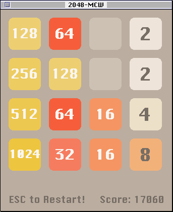
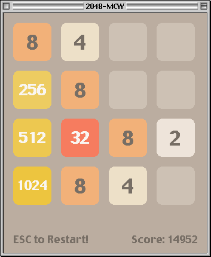
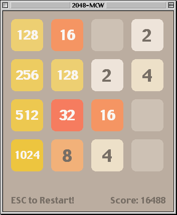
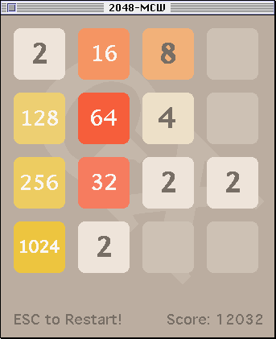
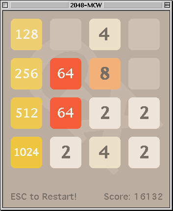
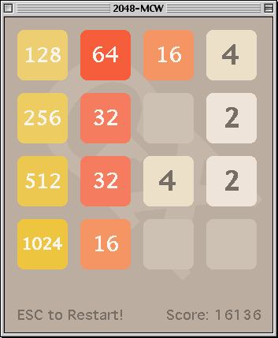
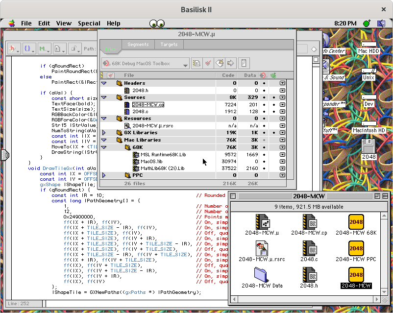
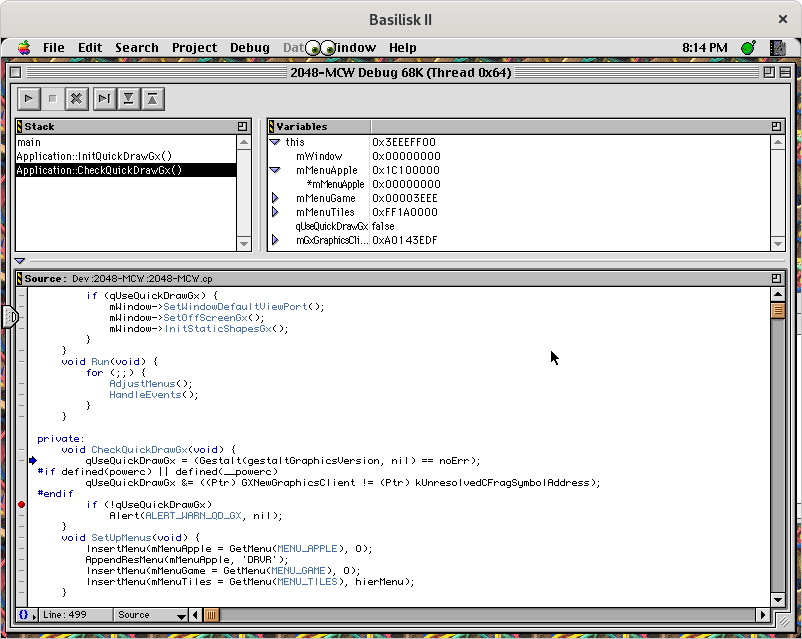

2048-MCW
========

| Render       | Mac OS System 7.5.3 | Mac OS 8.1 | Mac OS 9.0 |
|--------------|---------------------|------------|------------|
| QuickDraw    |  |  |  |
| QuickDraw GX |  |  |  |

Port 2048 game to the [classic Mac OS](https://en.wikipedia.org/wiki/Classic_Mac_OS) platform (System 7-9) with using [Macintosh Toolbox](https://en.wikipedia.org/wiki/Macintosh_Toolbox), [QuickDraw](https://en.wikipedia.org/wiki/QuickDraw), and [QuickDraw GX](https://en.wikipedia.org/wiki/QuickDraw_GX) technologies.

## Setup Basilisk II Environment

1. Install [Mac OS 8.1](https://winworldpc.com/product/mac-os-8/81) into [Basilisk II](https://en.wikipedia.org/wiki/Basilisk_II) emulator through [Basilisk II Setup](https://www.emaculation.com/doku.php/basilisk_ii_setup) installation guide.
2. Install [CodeWarrior Pro 4](https://macintoshgarden.org/apps/codewarrior-pro-4) Tools and IDE which requires at least 500 MB for installation.
3. *Optional:* Install [QuickDraw GX](https://macintoshgarden.org/apps/quickdraw-gx) library, v1.1.2 for Mac OS System 7 and v1.1.6 for Mac OS 8 and Mac OS 9.

## Building using Metrowerks CodeWarrior IDE

1. Attach "TODO" floppy disk image on ther "Volumes" tab in Basilisk II emulator and start Mac OS 8.1 with it.
2. Copy "2048-MCW" folder from floppy disk to the your main storage drive.
3. Open "2048-MCW:2048-MCW.μ" project file with Metrowerks CodeWarrior IDE.
4. Set "FAT MacOS Toolbox" instead of "68K Debug MacOS Toolbox" target.
5. In the main menu choose "Project" => "Make", wait for the compilation process to complete.
6. Get resulted executable files in the "2048-MCW" directory with following names:
  - 2048-MCW 68K - Final (release) version for [Motorola 68000](https://en.wikipedia.org/wiki/Motorola_68000) architecture.
  - 2048-MCW PPC - Final (release) version for [PowerPC](https://en.wikipedia.org/wiki/PowerPC) architecture.
  - 2048-MCW - Final (release) FAT version for both architectures.

## Building using Metrowerks CodeWarrior MPW

// TODO: Apple MPW, description.

## Additional Information

The old Apple Developer site had some interesting publications in the [develop Articles on QuickDraw GX](http://web.archive.org/web/20041012004904/http://developer.apple.com/dev/techsupport/develop/bysubject/quickdrawgx.html) section about QuickDraw GX rendering, e.g. useful [Flicker-Free Drawing With QuickDraw GX](http://web.archive.org/web/20041029052644/http://developer.apple.com/dev/techsupport/develop/issue25/ayala.html) article.

This repository contains the source files with the Unix **LR** [line breaks](https://en.wikipedia.org/wiki/Newline) for convenience. Don't forget to change the line breaks to **CR**, which are used in classic macOS. This can be easily done using the `unix2mac` utility which is included in the "dos2unix" package. The reverse process can be done with `mac2unix` utility.

See [NotesClassicMacOS.md](../../doc/NotesClassicMacOS.md) document for some additional information.

## Classic Mac OS Development Environment

Metrowerks CodeWarrior IDE 3.2 (part of Metrowerks CodeWarrior Pro 4 distribution):

## Versions

1. [Basilisk II 1.0](https://github.com/cebix/macemu)
2. [Apple Mac OS 8.1](https://winworldpc.com/download/7724c394-e280-9362-c382-11c3a6e28094)
3. [CodeWarrior Pro 4](https://macintoshgarden.org/sites/macintoshgarden.org/files/apps/CWPro4Tools.cdr_.zip) (with CodeWarrior IDE version 3.2 build 0158)
4. [ResEdit 2.1.3](https://en.wikipedia.org/wiki/ResEdit)
