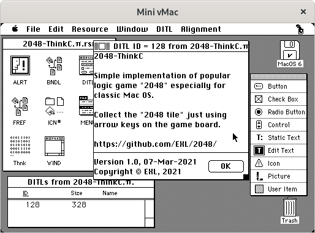

2048-ThinkC
===========

Port 2048 game to the classic Mac OS platform ([System 6](https://en.wikipedia.org/wiki/System_6)) with using [Macintosh Toolbox](https://en.wikipedia.org/wiki/Macintosh_Toolbox) and [QuickDraw](https://en.wikipedia.org/wiki/QuickDraw) technologies.

## Setup Mini vMac Environment

1. Install [Mac OS System 6](https://winworldpc.com/product/mac-os-0-6/system-6x) into [Mini vMac](https://en.wikipedia.org/wiki/VMac) emulator through [Mini vMac Setup](https://www.emaculation.com/doku.php/mini_vmac_setup) installation guide.
2. Copy [TeachText](https://en.wikipedia.org/wiki/TeachText) application from installation floppy disk to the "System Folder".
3. Install [Symantec THINK C](https://macintoshgarden.org/apps/think-c) IDE through [think_c_5-0-2.zip](https://macintoshgarden.org/sites/macintoshgarden.org/files/apps/think_c_5-0-2.zip) ZIP-archive: unpack it and drag-and-drop floppy disks images into Mini vMac emulator window.

### Symantec THINK C Installation Procedure

1. In the Finder, create a new folder and name it "Development".
2. Insert the "THINK C 2" disk, and double-click on the "Headers & Libs.sea" self-extracting archive.
3. A standard file dialog appears. Move to your "Development" folder and click "Extract" button.
4. Repeat steps 2-4 for the each of the other archives on "THINK C 2", "THINK C 3", and "THINK C 4" disks.
5. Insert "THINK C 1" disk, and move "THINK C 5.0" and "THINK C Debugger 5.0" executable files into the "THINK C 5.0 Folder" in your "Development" folder.

## Build & Run

1. Drag-and-drop "TODO" floppy disk image to the Mini vMac emulator window, then open "2048-ThinkC:2048-ThinkC.π" project file with Symantec THINK C IDE.
2. In the main menu choose "Project" => "Build Application...", then click "Yes" button.
3. Save application as 2048-ThinkC with "Smart Link" option, replace existing file.
4. Quit Symantec THINK C IDE.
5. Open "2048-ThinkC:2048-ThinkC.π.rsrc" resource file with Apple ResEdit program.
6. In the main menu choose "File" => "Get File/Folder Info...", select 2048-ThinkC executable file and click "Get Info" button.
7. Change "Creator:" field from "????" to "Thnk", unset "Inited" and set "Has BNDL" checkmarks.
8. Close "Info for 2048-ThinkC" window and save changes. These actions will set the icon for the 2048-ThinkC application.
9. Quit Apple ResEdit program.
10. Double-click on the 2048-ThinkC file to run application.

## Additional Information

You can use [ImportFl](https://www.gryphel.com/c/minivmac/extras/importfl/index.html) application to transfer files inside the classic Mac OS. Just drag-and-drop ImportFl image on the Mini vMac emulator window, run "ImportFl" executable file, and drag-and-drop your files and save them on the Mac OS disk.

This repository contains the source files with the Unix **LR** [line breaks](https://en.wikipedia.org/wiki/Newline) for convenience. Don't forget to change the line breaks to **CR**, which are used in classic macOS. This can be easily done using the `unix2mac` utility which is included in the "dos2unix" package. The reverse process can be done with `mac2unix` utility.

The [Macintosh Toolbox with THINK C](https://nondisplayable.ca/2018/05/23/what-think-c-doesnt-tell-you.html) manual describes the basics of classic Mac OS System 1-6 programming with using Apple Macintosh Toolbox framework and Symantec THINK C IDE.

The [ExOffScreen](../ExOffScreen) example shows fast offscreen drawing implementation based on the "Flight Simulator" demonstration program by Chris Moll. This helps to avoid screen flickering and visible redrawing of parts of the window.

See [NotesClassicMacOS.md](../../doc/NotesClassicMacOS.md) document for some additional information.

## Classic MacOS Development Environment

Symantec THINK C 5.0.2:

Apple ResEdit 2.1.1:

## Versions

1. [Mini vMac 36.04](https://www.gryphel.com/c/minivmac/dnld_std.html)
2. [Apple Mac OS 6.0.8.1 [International]](https://winworldpc.com/download/aa9141cd-d7aa-11e7-a73f-fa163e9022f0)
3. [Symantec THINK C 5.0.2](https://macintoshgarden.org/sites/macintoshgarden.org/files/apps/think_c_5-0-2.zip)
4. [ResEdit 2.1.1](https://en.wikipedia.org/wiki/ResEdit)
5. [ImportFl 1.2.2](https://www.gryphel.com/d/minivmac/extras/importfl/importfl-1.2.2.zip)

## Additional Screenshots

2048-ThinkC application running on the classic Mac OS 8.1:

  
