2048-UIQ2
=========

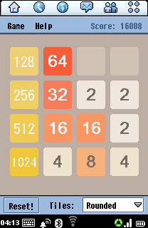 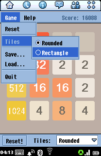 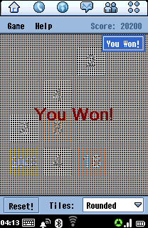 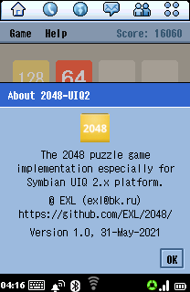

The "2048" game for the [Symbian UIQ 2.x](https://en.wikipedia.org/wiki/UIQ) platform.

## Symbian UIQ2 SDK

// TODO: Add normal link mirrored to forum.motofan.ru

Download "UIQ SDK v2.1" and "UIQ SDK v2.1 update 1" archives from [this link](https://mrrosset.github.io/Symbian-Archive/SDKs-UIQ&S3.html).

## Install Symbian UIQ2 SDK

Windows 2000 Recipe:

1. Install [Microsoft Windows 2000 Professional (Retail with SP4, English version)](https://winworldpc.com/download/413ce280-9436-18c3-9a11-c3a4e284a2ef) to the virtual machine.
2. Install [Microsoft Visual Studio 6.0](https://winworldpc.com/download/0cc395c2-b7c3-99c3-89c3-b811c3a4efbf) IDE.\
    _Note._ Microsoft Visual C++ 6.0 and its dependencies will suffice, be sure to register system-wide environment variables.
3. Install [Microsoft Visual Studio 6.0 Service Pack 6](https://winworldpc.com/download/a4208baa-aaee-11eb-bc5b-0200008a0da4) update.
4. Unpack "uiq_2_1_sdk_wins.zip" archive and setup all SDK components to the "C:\Symbian\UIQ_21\" directory.
5. Unpack "uiq21_update1_wins.zip" archive and go through "Update1_ReleaseNotes.txt" installation manual.

## Build SIS-package for UIQ2 platform

### Linux Host

```sh
git clone https://github.com/EXL/2048
cd 2048/
unix2dos src/wsd/*
unix2dos 2048-UIQ2/*
zip -r 2048-UIQ2.zip src/wsd/ 2048-UIQ2/ image/icon/*.bmp
```

Move "2048-UIQ2.zip" archive to the Windows 2000 machine, unpack it to the "C:\Symbian\UIQ_21\Projects\2048\" directory then run `cmd.exe` "Command Prompt" program.

### Windows 2000 Guest

```bat
cd C:\Symbian\UIQ_21\Projects\2048\2048-UIQ2\
devices -setdefault @UIQ_21:com.symbian.UIQ

bldmake bldfiles      & REM Generate build script.
abld clean            & REM Clean all build directories.
abld build            & REM Build executables for all architectures and build types.
abld build armi urel  & REM Build release executables for 'armi' architecture.
abld build arm4 urel  & REM Build release executables for 'arm4' architecture.
abld build thumb urel & REM Build release executables for 'thumb' architecture.
abld build wins udeb  & REM Build debug executables for emulator/simulator.
epoc                  & REM Run Symbian UIQ2 emulator/simulator in debug mode.
abld build wins urel  & REM Build release executables for emulator/simulator.
epoc -urel            & REM Run Symbian UIQ2 emulator/simulator in release mode.
makesis 2048-UIQ2.pkg & REM Create SIS-package
```

## Additional Stuff

Symbian UIQ 2.1 screenshots from Motorola FOMA M1000:

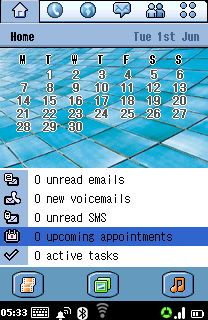 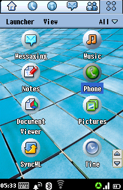 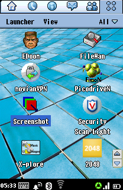 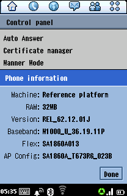

2048-UIQ2 running on Motorola FOMA M1000:

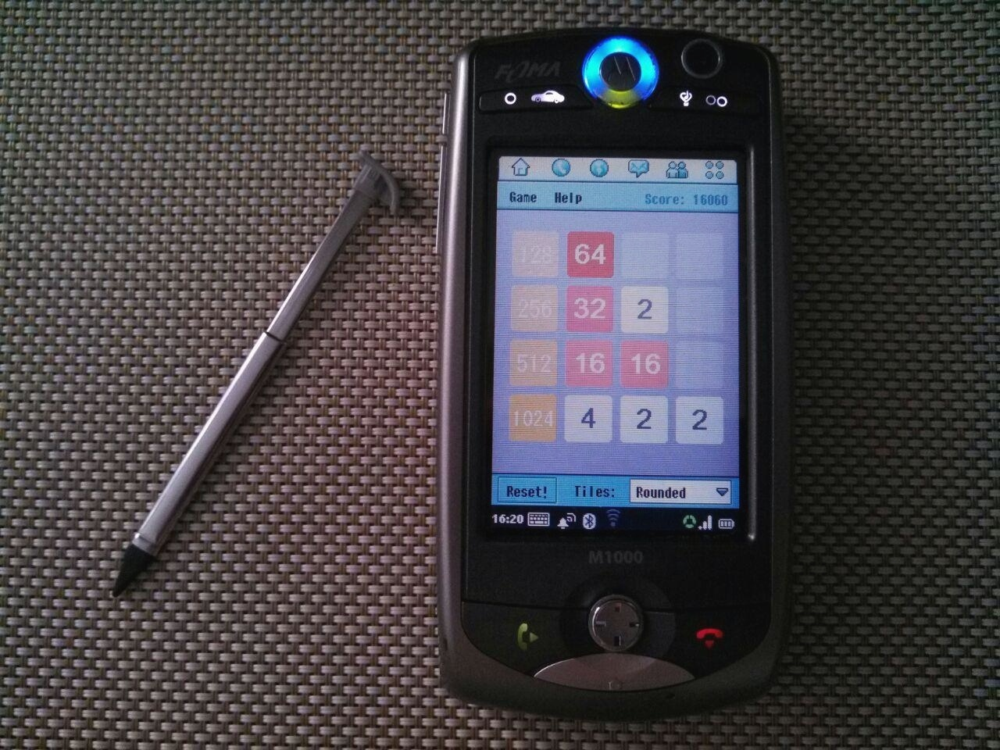

2048-UIQ2 running on Motorola A1000 (thanks to javelin67 for the photo):

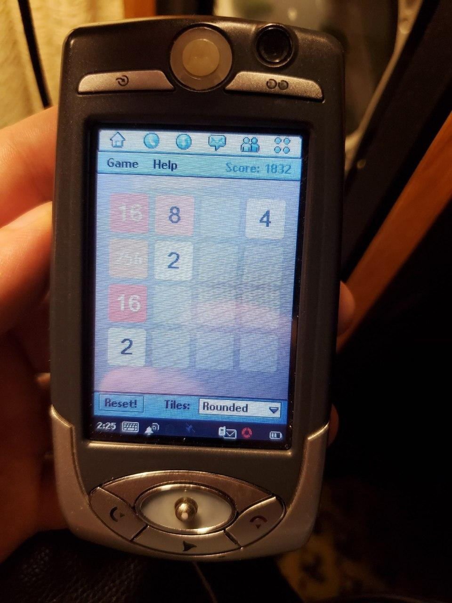

2048-UIQ2 running on Motorola A925 (thanks to [Limows](https://github.com/Limows/) for the photo):

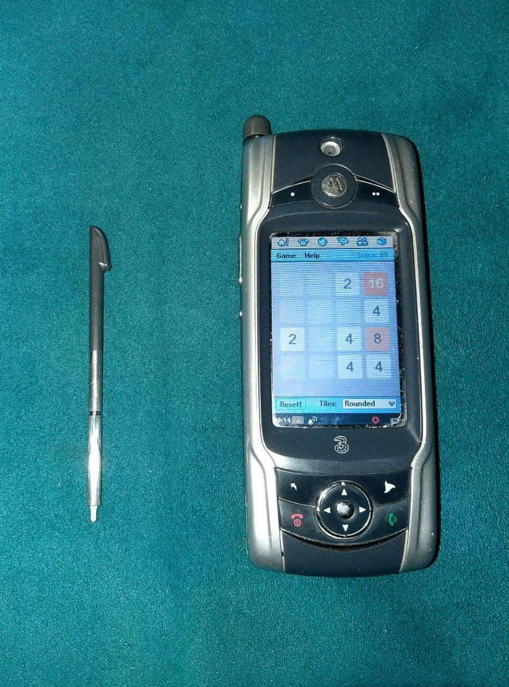

2048-UIQ2 running on Motorola A920 (thanks to VodkaDealer for the photo):

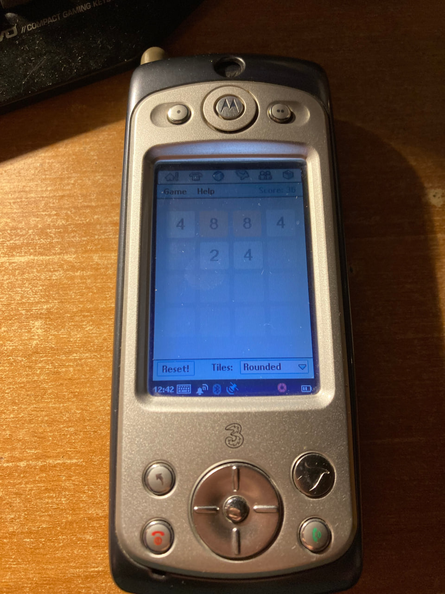

2048-UIQ2 running on Sony Ericsson P910 (thanks to SHBEN for the photo):

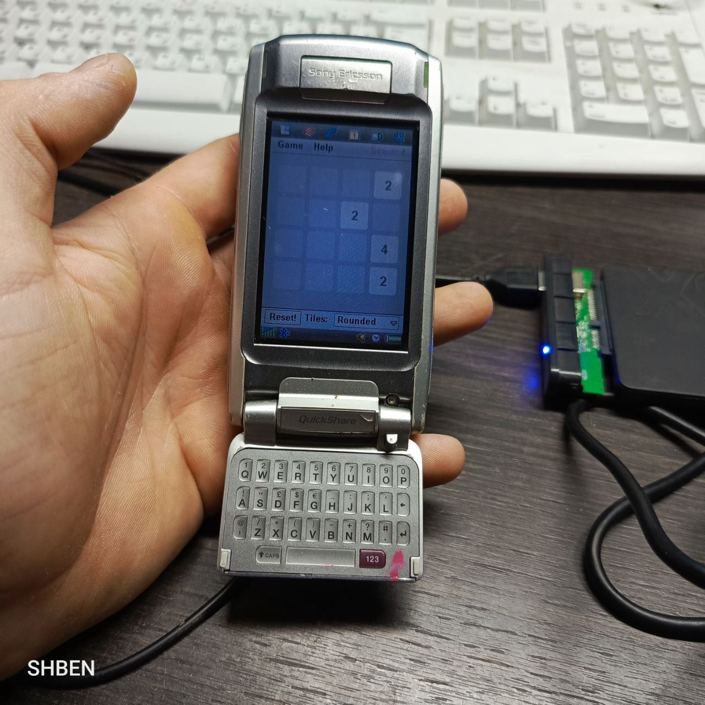

2048-UIQ2 running on Sony Ericsson P900 (thanks to [gtrxAC](https://github.com/gtrxAC/) for the photo):

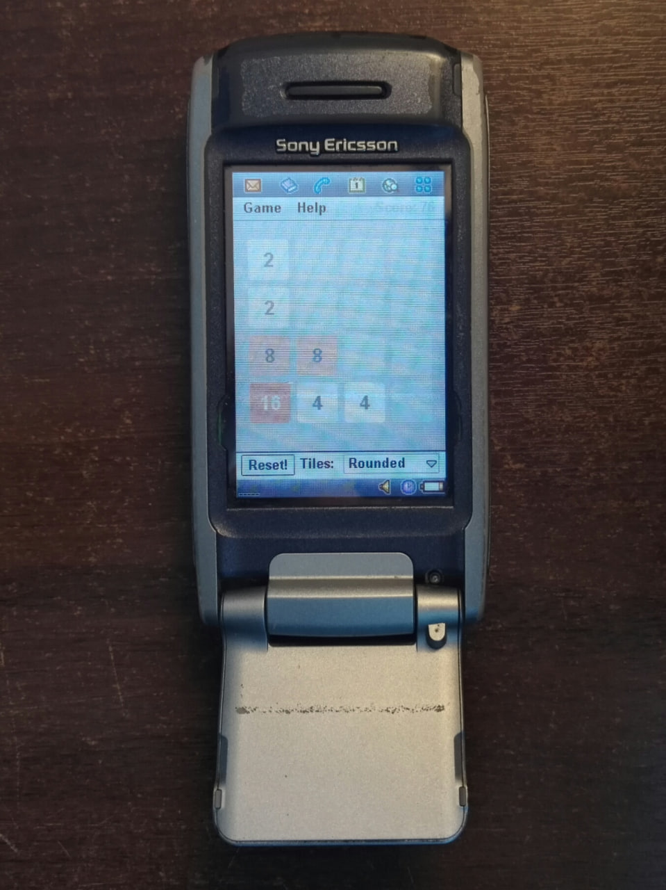

2048-UIQ2 running on Sony Ericsson P800 (thanks to javelin67 for the photo):

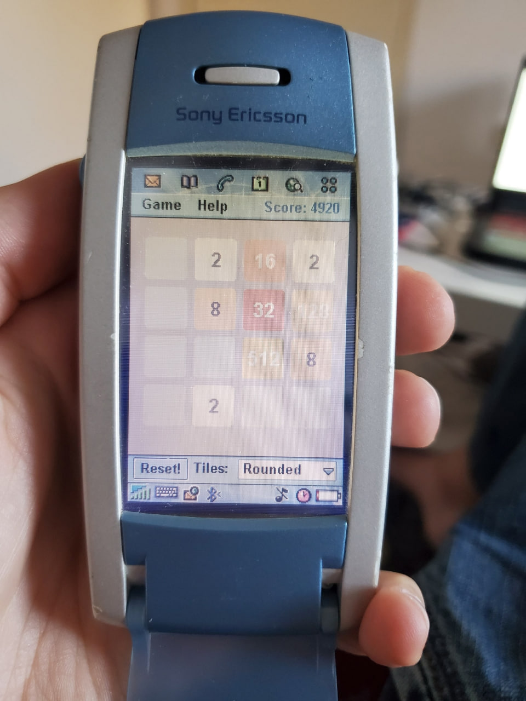

2048-UIQ2 running on Nokia 6708 (thanks to Dmitry Zakharov for the photo):

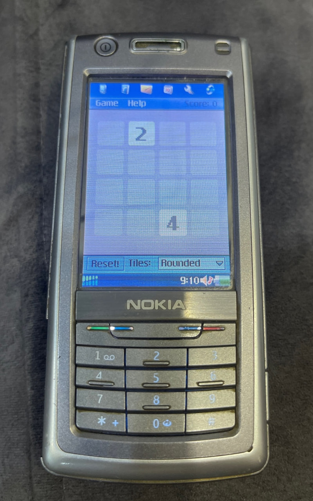

## Symbian UIQ2 Development Environment

Microsoft Visual C++ 6.0, Symbian UIQ2 emulator/simulator, and Command Prompt:

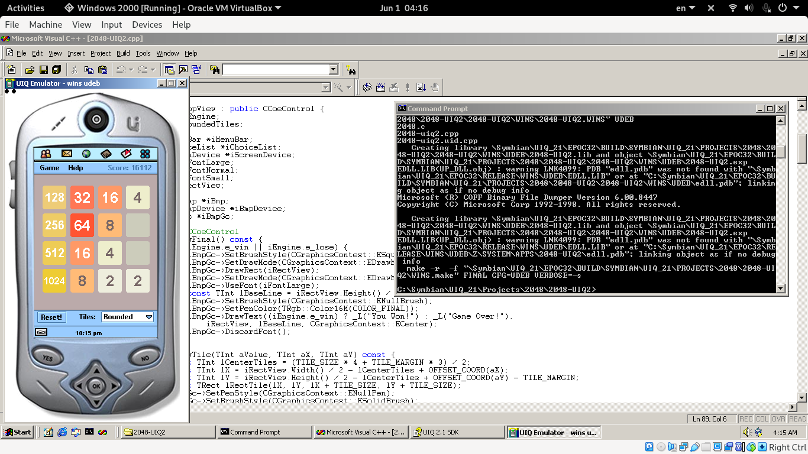

## Versions

* System: Microsoft Windows 2000 (5.00.2195) Service Pack 4
* IDE: Microsoft Visual C++ 6.0 Service Pack 6

```
cl.exe
Microsoft (R) 32-bit C/C++ Optimizing Compiler Version 12.00.8804 for 80x86
Copyright (C) Microsoft Corp 1984-1998. All rights reserved.

gcc.exe -v
Reading specs from \Symbian\UIQ_21\epoc32\gcc\bin\..\lib\gcc-lib\arm-epoc-pe\2.9-psion-98r2\specs
gcc version 2.9-psion-98r2 (Symbian build 542)

g++.exe -v
Reading specs from \Symbian\UIQ_21\epoc32\gcc\bin\..\lib\gcc-lib\arm-epoc-pe\2.9-psion-98r2\specs
gcc version 2.9-psion-98r2 (Symbian build 542)
```

## Information

* [NotesUIQ2.md](../doc/NotesUIQ2.md): Document contains additional information about developing UIQ2 applications.
