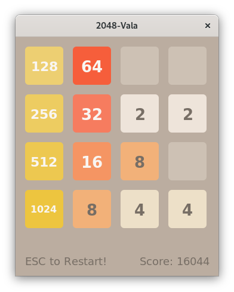
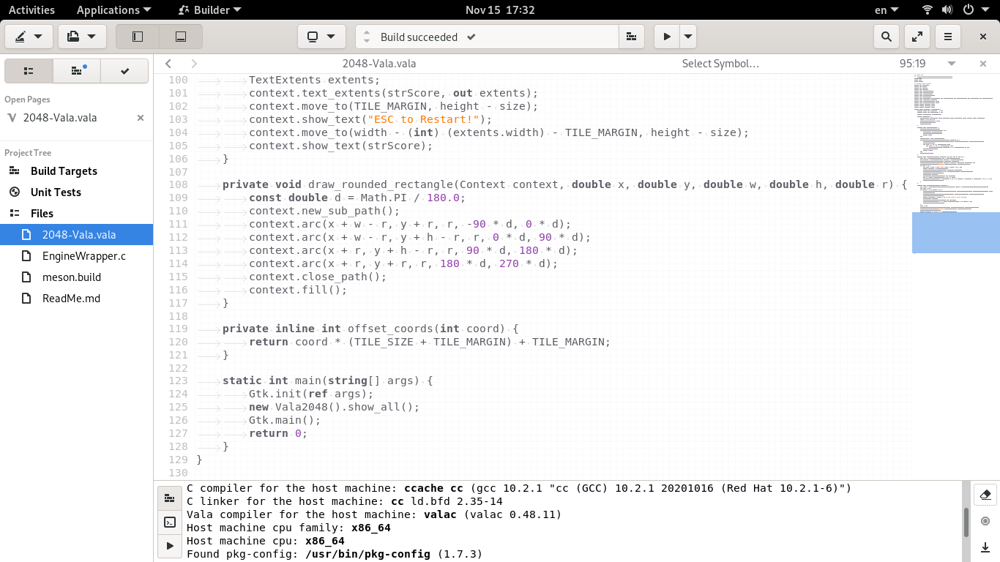

2048-Vala
=========



## Build & Run

CentOS 7 Recipe:

```sh
sudo yum -y install epel-release

sudo yum -y install @development
sudo yum -y install cmake3
sudo yum -y install gtk3-devel

cd ~/Projects/
git clone https://github.com/EXL/2048
cd 2048/2048-Vala/
mkdir build; cd build/
meson --buildtype release ..
ninja -v
strip -s 2048-Vala

./2048-Vala
```

## GNOME Development Environment

GNOME Builder 3.38.1:


