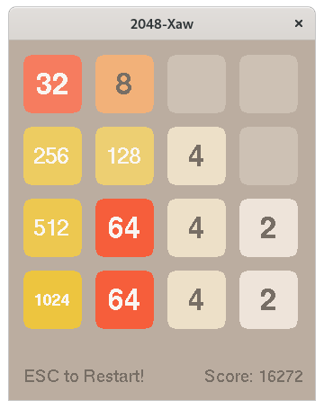

2048-Xaw
========



## Build & Run

CentOS 7 Recipe:

```sh
sudo yum -y install epel-release

sudo yum -y install @development
sudo yum -y install cmake3
sudo yum -y install libXaw-devel
sudo yum -y install xorg-x11-fonts-ISO8859-1-100dpi

cd ~/Projects/
git clone https://github.com/EXL/2048
cd 2048/2048-Xaw/
cmake3 -DCMAKE_BUILD_TYPE=Release .
make VERBOSE=1
strip -s 2048-Xaw

./2048-Xaw
```
