2048-eBookMan
=============

The [Franklin eBookMan](https://en.wikipedia.org/wiki/Franklin_eBookMan) is a discontinued handheld device made to read ebooks. This gadget, made from 1999 until 2002, has standard PDA functions and can play MP3 and record sounds. It has a black on green touchscreen, contains 8 or 16 MB of RAM, and uses its own proprietary eBookMan OS. Its handwriting recognition system accepts nearly natural handwriting.

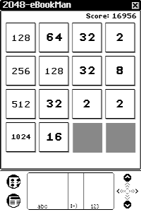 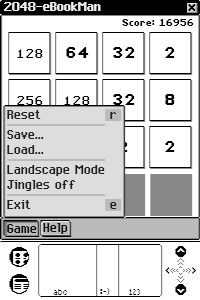 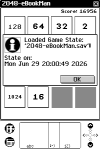

  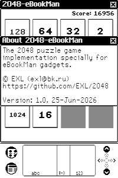


The device uses a unique RISC architecture on CPU/MCU side called Sneak32 (Snk32), about which there is very little information available on the Internet. The Sneak32 CPU is a proprietary 32-bit CPU developed by Franklin, and based on Franklin's earlier 24-bit CPU called Sneak8 (and sometimes, Sneak24).

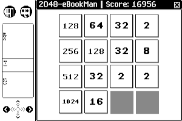 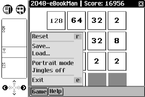 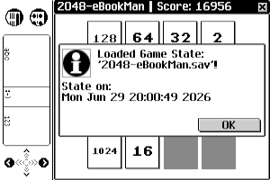

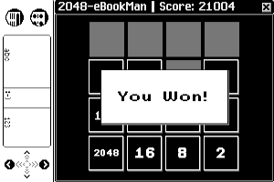  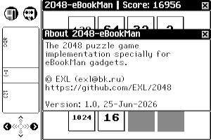

## Build SEB Package

Download building tools from copy of the official [Franklin Developer site](https://web.archive.org/web/20030104060658/http://download.franklin.com/franklin/ebookman/developer/) on WebArchive and install them using Installing guide: 

* [Cygwin 1.1.2](https://web.archive.org/web/20030104060658/http://download.franklin.com/franklin/ebookman/publisher/cygwin-1.1.2.exe)
* [SDK Tools for Windows/Cygwin 020419](https://web.archive.org/web/20030104060658/http://download.franklin.com/franklin/ebookman/developer/ebsdk_tool_cyg_020419.tgz)
* [INSTALL.020419](https://web.archive.org/web/20030104060658/http://download.franklin.com/franklin/ebookman/developer/INSTALL.020419)

Run *Cygwin Bash Shell* and execute following commands:

```sh
cd 2048/2048-eBookMan
make clean
make
make seb
```

## Gallery

eBookMan OS 020419: [[Download]](https://web.archive.org/web/20030104060658/http://download.franklin.com/franklin/ebookman/developer/ebsdk_ebm_020419.tgz)

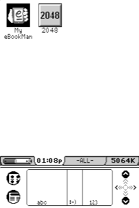 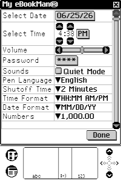 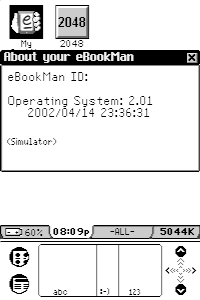

// eBookMan Photos

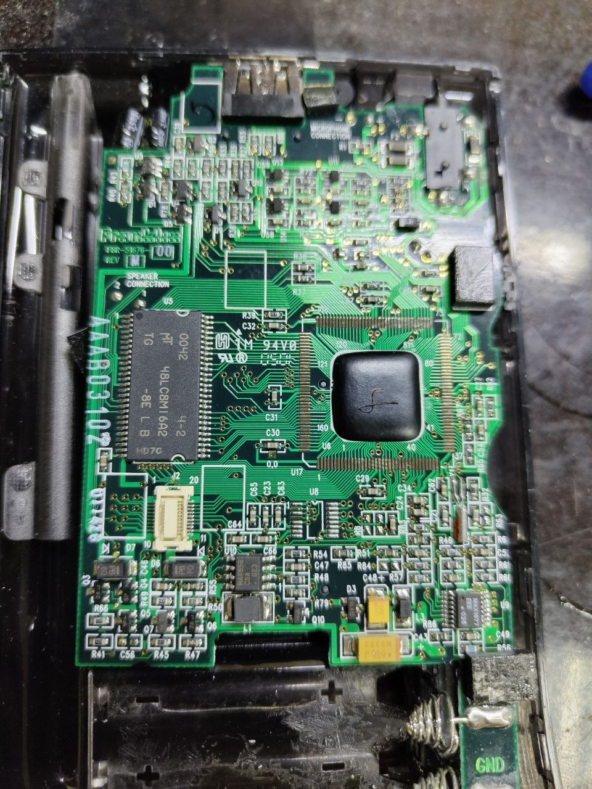 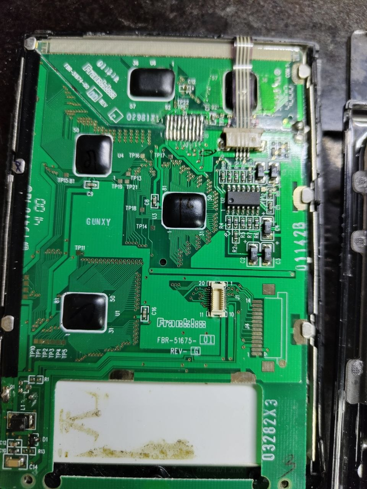
*Note: Thanks to SHBEN.*

## Versions

```sh
$ /franklin/SDK/winXX/bin/sneak32-g++ -v
Reading specs from /franklin/SDK/winXX/lib/gcc-lib/sneak32/2.95.2/specs
gcc version 2.95.2 19991024 (release)

$ /franklin/SDK/winXX/bin/sneak32-gcc -v
Reading specs from /franklin/SDK/winXX/lib/gcc-lib/sneak32/2.95.2/specs
gcc version 2.95.2 19991024 (release)
```

## Thanks

* amix (@amix307)
* SHBEN (@SHU8IT)

## Archive Links

* [Franklin eBookMan® SDK Download Library](https://web.archive.org/web/20030104060658/http://download.franklin.com/franklin/ebookman/developer/)
* [FAQ for the Franklin eBookMan® SDK](https://web.archive.org/web/20030206183611/http://download.franklin.com/franklin/ebookman/developer/sdkfaq.html)
* [Software Development Kit Documentation](https://web.archive.org/web/20051120134937/http://download.franklin.com/franklin/ebookman/developer/doc/index.html)

    Note: It's better to use the one version that comes with the SDK. It's more up-to-date.

* [Bookman Archive](https://bookmanarchive.com/)
* [eBookman SDK release 2002-04-19](https://archive.org/details/eBookMan-sdk-020419)
* [github.com/bookmanarchive](https://github.com/bookmanarchive)
* [r/franklinbookman](https://www.reddit.com/r/franklinbookman/)
* [The worst thing that ever happened to the PDA](https://www.pvsm.ru/news/383236) (in Russian)
