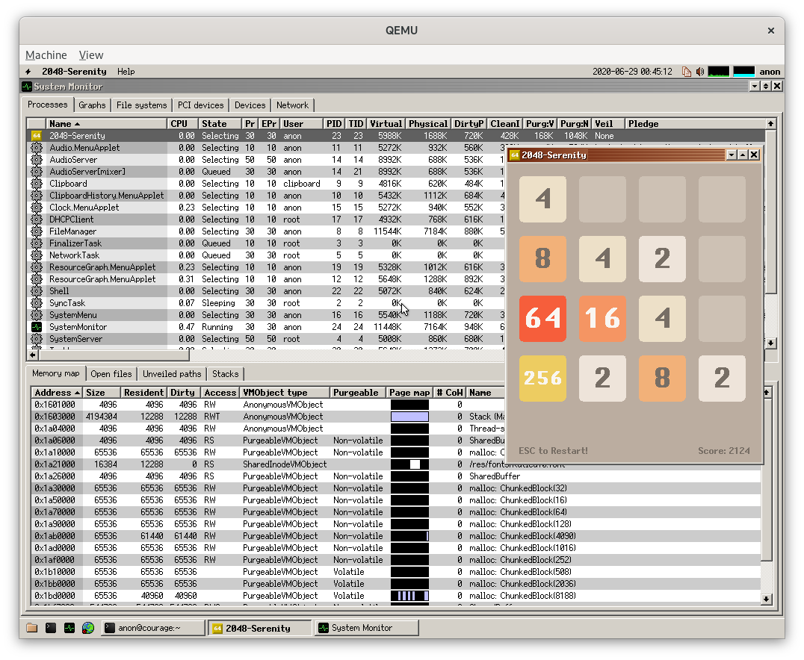

Memory Consumption on Various Platform
======================================

Information were obtained:

1. By using `cat /proc/$PID/status` command on Fedora and MotoMAGX platform.
2. By using `top` command and "System Monitor" application on Serenity OS.
3. By using `showmem -P $PID` command on QNX.
4. By using `px aux` command on NeXTSTEP.

*Note: `$PID` is Process Identifier of the executable file.*

### 2048-Qt5

GNOME System Monitor: 9.8 MiB

```
cat /proc/`pidof 2048-Qt5`/status
...
VmPeak:  1063488 kB
VmSize:  1002036 kB
VmLck:         0 kB
VmPin:         0 kB
VmHWM:     50984 kB
VmRSS:     50984 kB
RssAnon:   10036 kB
RssFile:   40412 kB
RssShmem:    536 kB
VmData:    84656 kB
VmStk:       132 kB
VmExe:        20 kB
VmLib:     42540 kB
VmPTE:       328 kB
VmSwap:        0 kB
HugetlbPages:  0 kB
```

### 2048-Qt4

GNOME System Monitor: 3.0 MiB

```
cat /proc/`pidof 2048-Qt4`/status
...
VmPeak:   289748 kB
VmSize:   289748 kB
VmLck:         0 kB
VmPin:         0 kB
VmHWM:     25204 kB
VmRSS:     25204 kB
RssAnon:    3080 kB
RssFile:   21592 kB
RssShmem:    532 kB
VmData:     2556 kB
VmStk:       132 kB
VmExe:        20 kB
VmLib:     20540 kB
VmPTE:       156 kB
VmSwap:        0 kB
HugetlbPages:  0 kB
```

### 2048-Qt3

GNOME System Monitor: 2.1 MiB

```
cat /proc/`pidof 2048-Qt3`/status
...
VmPeak:   245084 kB
VmSize:   245084 kB
VmLck:         0 kB
VmPin:         0 kB
VmHWM:     15216 kB
VmRSS:     15216 kB
RssAnon:    2144 kB
RssFile:   13072 kB
RssShmem:      0 kB
VmData:     1748 kB
VmStk:       132 kB
VmExe:        28 kB
VmLib:     10460 kB
VmPTE:       116 kB
VmSwap:        0 kB
HugetlbPages:  0 kB
```

### 2048-Qt2

GNOME System Monitor: 1.2 MiB

```
cat /proc/`pidof 2048-Qt2`/status
...
VmPeak:   240780 kB
VmSize:   240780 kB
VmLck:         0 kB
VmPin:         0 kB
VmHWM:     11900 kB
VmRSS:     11816 kB
RssAnon:    1248 kB
RssFile:   10568 kB
RssShmem:      0 kB
VmData:      884 kB
VmStk:       132 kB
VmExe:        28 kB
VmLib:      9744 kB
VmPTE:       112 kB
VmSwap:        0 kB
HugetlbPages:  0 kB
```

### 2048-Qt1

GNOME System Monitor: 512.0 KiB

```
cat /proc/`pidof 2048-Qt1`/status
...
VmPeak:   222656 kB
VmSize:   222504 kB
VmLck:         0 kB
VmPin:         0 kB
VmHWM:      6100 kB
VmRSS:      6028 kB
RssAnon:     512 kB
RssFile:    5516 kB
RssShmem:      0 kB
VmData:      456 kB
VmStk:       132 kB
VmExe:        20 kB
VmLib:      4804 kB
VmPTE:        80 kB
VmSwap:        0 kB
HugetlbPages:  0 kB
```

### 2048-Gtk3

GNOME System Monitor: 4.6 MiB

```
cat /proc/`pidof 2048-Gtk3`/status
...
VmPeak:   458176 kB
VmSize:   398432 kB
VmLck:         0 kB
VmPin:         0 kB
VmHWM:     25536 kB
VmRSS:     25536 kB
RssAnon:    4696 kB
RssFile:   20840 kB
RssShmem:      0 kB
VmData:    20832 kB
VmStk:       132 kB
VmExe:        12 kB
VmLib:     17284 kB
VmPTE:       152 kB
VmSwap:        0 kB
HugetlbPages:  0 kB
```

### 2048-Gtk2

GNOME System Monitor: 2.2 MiB

```
cat /proc/`pidof 2048-Gtk2`/status
...
VmPeak:   240204 kB
VmSize:   240204 kB
VmLck:         0 kB
VmPin:         0 kB
VmHWM:     17116 kB
VmRSS:     17116 kB
RssAnon:    2268 kB
RssFile:   14848 kB
RssShmem:      0 kB
VmData:     1888 kB
VmStk:       132 kB
VmExe:        12 kB
VmLib:     13616 kB
VmPTE:       112 kB
VmSwap:        0 kB
HugetlbPages:  0 kB
```

### 2048-Gtk1

GNOME System Monitor: 480.0 KiB

```
cat /proc/`pidof 2048-Gtk1`/status
...
VmPeak:    15980 kB
VmSize:    15980 kB
VmLck:         0 kB
VmPin:         0 kB
VmHWM:      4776 kB
VmRSS:      4668 kB
RssAnon:     480 kB
RssFile:    4188 kB
RssShmem:      0 kB
VmData:      540 kB
VmStk:       132 kB
VmExe:        12 kB
VmLib:      4192 kB
VmPTE:        60 kB
VmSwap:        0 kB
HugetlbPages:  0 kB
```

### 2048-Motif

GNOME System Monitor: 832.0 KiB

```
cat /proc/`pidof 2048-Motif`/status
...
VmPeak:   225024 kB
VmSize:   224872 kB
VmLck:         0 kB
VmPin:         0 kB
VmHWM:      7140 kB
VmRSS:      7040 kB
RssAnon:     832 kB
RssFile:    6208 kB
RssShmem:      0 kB
VmData:      812 kB
VmStk:       132 kB
VmExe:        12 kB
VmLib:      6620 kB
VmPTE:        92 kB
VmSwap:        0 kB
HugetlbPages:  0 kB
```

### 2048-Xaw

GNOME System Monitor: 332.0 KiB

```
cat /proc/`pidof 2048-Xaw`/status
...
VmPeak:     5380 kB
VmSize:     5380 kB
VmLck:         0 kB
VmPin:         0 kB
VmHWM:      3576 kB
VmRSS:      3576 kB
RssAnon:     332 kB
RssFile:    3244 kB
RssShmem:      0 kB
VmData:      472 kB
VmStk:       132 kB
VmExe:        12 kB
VmLib:      2900 kB
VmPTE:        48 kB
VmSwap:        0 kB
HugetlbPages:  0 kB
```

### 2048-Xlib

GNOME System Monitor: 116.0 KiB

```
cat /proc/`pidof 2048-Xlib`/status
...
VmPeak:     3896 kB
VmSize:     3876 kB
VmLck:         0 kB
VmPin:         0 kB
VmHWM:       932 kB
VmRSS:       932 kB
RssAnon:     116 kB
RssFile:     816 kB
RssShmem:      0 kB
VmData:      216 kB
VmStk:       132 kB
VmExe:        12 kB
VmLib:      2160 kB
VmPTE:        48 kB
VmSwap:        0 kB
HugetlbPages:  0 kB
```

### 2048-Xcb

GNOME System Monitor: 96.0 KiB

```
cat /proc/`pidof 2048-Xcb`/status
...
VmPeak:     2608 kB
VmSize:     2588 kB
VmLck:         0 kB
VmPin:         0 kB
VmHWM:       744 kB
VmRSS:       744 kB
RssAnon:      96 kB
RssFile:     648 kB
RssShmem:      0 kB
VmData:      204 kB
VmStk:       132 kB
VmExe:        12 kB
VmLib:      1588 kB
VmPTE:        48 kB
VmSwap:        0 kB
HugetlbPages:  0 kB
```

### 2048-MotoMAGX_ZN5

```
cat /proc/`pidof 2048-MotoMAGX_ZN5`/status
...
VmSize:    28748 kB
VmLck:         0 kB
VmRSS:      5556 kB
VmData:     1148 kB
VmStk:        84 kB
VmExe:        36 kB
VmLib:      9508 kB
VmPTE:        26 kB
```

### 2048-Serenity

```
top
...
   PID TID PRI  USER       STATE         VIRT    PHYS  %CPU  NAME
    84  84 30   anon       Selecting     6164    1732   0.0  2048-Serenity
```



```
Virtual:    6164 kB
Physical:   1732 kB
DirtyP:      712 kB
CleanI:      480 kB
PurgV:       164 kB
PurgN:      1048 kB
```

### 2048-NeXTSTEP

```
ps aux | head -1 && ps aux | grep 2048
USER       PID  %CPU %MEM VSIZE RSIZE TT STAT  TIME COMMAND
root       223   0.0  1.2 4.31M 1.52M ?  SW    0:00 /me/Apps/2048-NeXTSTEP.app/
```

### 2048-Photon

```
showmem -P `ps -A | grep 2048-Photon | head -1 | awk {print $1}`
...
Process listing (Total, Code, Data, Heap, Stack, Other)
  2183168    1855488     102400     200704      24576          0      765987 2048-Photon
Shared shared objects (Total, Code, Data, Heap, Stack, Other)
```
